# Delve + Goland 进行Go进程调试

---

## 安装

### 方案一：克隆git仓库进行编译

```sh-session
$ git clone https://github.com/go-delve/delve
$ cd delve
$ go install github.com/go-delve/delve/cmd/dlv
```

### 方案二：go version >= 1.16

```sh-session
# Install the latest release:
$ go install github.com/go-delve/delve/cmd/dlv@latest

# Install at tree head:
$ go install github.com/go-delve/delve/cmd/dlv@master

# Install at a specific version or pseudo-version:
$ go install github.com/go-delve/delve/cmd/dlv@v1.7.3
$ go install github.com/go-delve/delve/cmd/dlv@v1.7.4-0.20211208103735-2f13672765fe
```

如果在安装步骤中收到类似以下的错误：

```shell
found packages native (proc.go) and your_operating_system_and_architecture_combination_is_not_supported_by_delve (support_sentinel.go) in /home/pi/go/src/github.com/go-delve/delve/pkg/proc/native
```

这意味着你的操作系统和CPU架构的组合不被支持，检查go版本的输出。   

### Homebrew

```shell
brew install delve
```

### macOS 注意事项

在 macOS 上，确保同时安装了命令行开发工具：

```shell
$ xcode-select --install
```

如果您没有使用 Xcode 启用开发者模式，则每次使用调试器时都会被要求授权。要启用 "开发者模式 "并只需在每个会话中授权一次，请使用

```shell
sudo /usr/sbin/DevToolsSecurity -enable
```

您可能还需要将您的用户添加到开发人员组：

```shell
sudo dscl . append /Groups/_developer GroupMembership $(whoami)
```

### 编译 macOS 原生后端

您不需要 macOS 本机后端，它存在已知问题。如果您仍然想构建它：

1. 运行 xcode-select --install

2. 在 macOS 10.14 上，通过运行 /Library/Developer/CommandLineTools/Packages/macOS_SDK_headers_for_macOS_10.14.pkg 手动安装旧版包含标头

3. 将 repo 克隆到 $GOPATH/src/github.com/go-delve/delve 中

4. 在该目录中运行 make install（在某些版本的 macOS 上，首次运行时需要 root 权限才能安装新证书）

makefile 将自动创建和安装自签名证书。

## Debug 正在运行的 Go 进程

在 GoLand 中，可以将调试器Attach到本地计算机、远程计算机或 Docker 容器中正在运行的 Go 进程。

### 本地主机进程

您可以调试从命令行启动的应用程序。在这种情况下，应用程序在 IDE 外部运行，但在同一台本地计算机上运行。要调试应用程序，您需要在 IDE 中打开项目并将调试器附加到正在运行的进程。

#### 1. 安装 gops 包

```shell
go get -t github.com/google/gops/
```

点击 Run | Attach to Process (`⌥Opt``⇧Shift``F5`) 在通知窗口中，单击调用“go get gops”链接。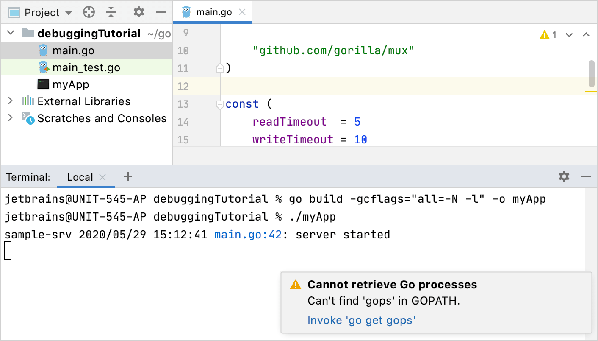

#### 2. 编译和运行应用

      1) . 打开Terminal 窗口（view | Tool Windows | Terminal）并根据您的 Go 版本运行以下命令：

```shell
// Go 1.10 and later:
$ go build -gcflags="all=-N -l" -o myApp

// Go 1.9 and earlier:
$ go build -gcflags="-N -l" -o myApp
```

该命令编译 myApp 可执行文件，并禁用编译器优化和内联。

    2). 运行已编译的可执行文件（例如./myApp）。

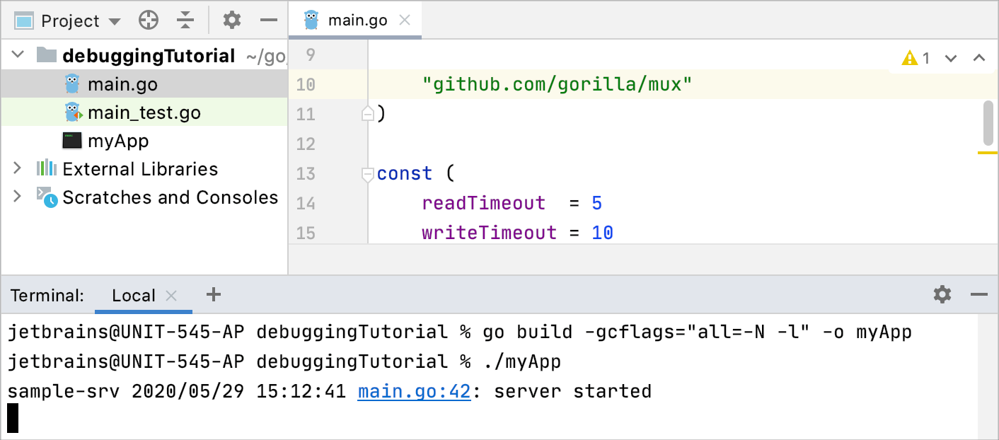

> 不要使用 -ldflags="all=-w" 或 -ldflags="-w" 标志。这些标志与调试应用程序不兼容，因为它们删除了 Delve 所需的必要 DWARF 信息。

由于 Go 工具链、Delve 和 GoLand 之间不兼容，符号链接或符号链接与调试不兼容。

#### 3. debug正在运行的进程

1. 单击代码行附近的装订线以放置断点。例如，在提供的代码示例中，将断点放在第 23 行 (message := fmt.Sprintf("Hello %s!", r.UserAgent()))。在断点中阅读有关断点的更多信息。

2. 点击 **Run | Attach to Process**`⌥Opt``⇧Shift``F5`.

3. 在 **Attach with Debugger To** 窗口中，选择您的应用程序进程并按↩进入。

4. 在应用程序中的断点处触发事件。如果您使用提供的[代码](https://github.com/apronichev/documentation-code-examples/blob/master/debuggingTutorial/main.go)示例，请在浏览器中打开 http://localhost:8080/ 链接。

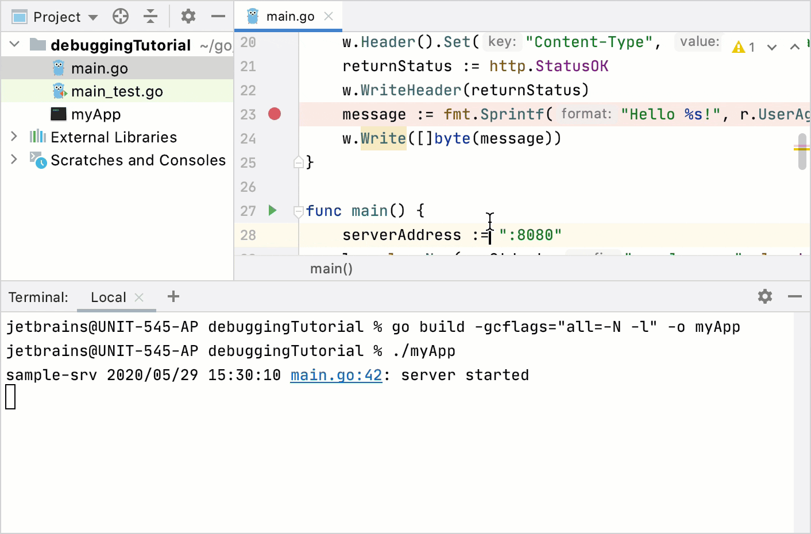

### 远程主机进程

您可以连接到远程计算机（主机）并将调试器附加到主机上运行的 Go 进程。远程调试器 (Delve) 必须在远程计算机上运行。

> 使用与应用程序相同的 Go 版本、主机和目标来编译 Delve，因为不同操作系统之间可能存在细微差异，这可能会导致调试会话无法按预期工作。

#### 1. 在远程机器上编译应用

1. 如果您使用 $GOPATH 方法，请确保在主机和客户端计算机上使用 $GOPATH 的相同相对路径来编译项目。例如，如果主机上的应用程序代码位于 $GOPATH/src/debuggingTutorial/ 中。客户端上的代码必须位于同一目录中（$GOPATH/src/debuggingTutorial/）。

2. 打开终端工具窗口（视图 | 工具窗口 | 终端）并根据您的 Go 版本运行以下命令：

```shell
// Go 1.10 and later:
$ go build -gcflags="all=-N -l" -o myApp

// Go 1.9 and earlier:
$ go build -gcflags="-N -l" -o myApp
```

此命令编译 myApp 可执行文件并禁用编译器优化和内联。

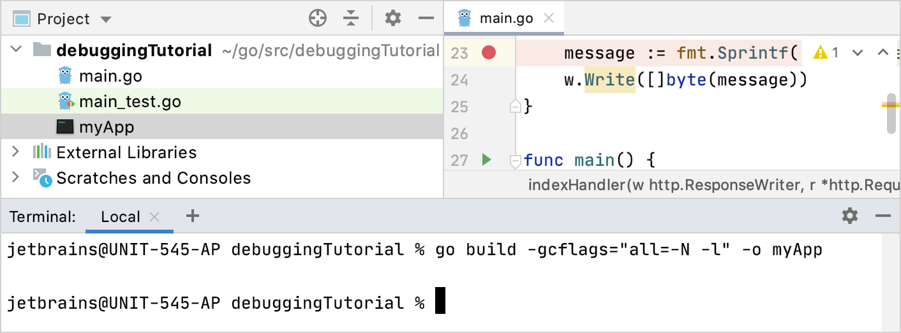

#### 2. 在远程主机上运行 Delve

您有两个选项可以在主机上启动调试器：

- 调试器会为您运行该进程。如果您使用防火墙，请公开配置中使用的端口（例如 2345）。您可以使用任何未被占用的端口号。 myApp 是在步骤 1 上构建的可执行文件的名称。

```shell
dlv --listen=:2345 --headless --continue --api-version=2 --accept-multiclient exec ./myApp
```

如果需要按原样将参数传递给二进制文件，请在前面的命令中添加双破折号 (--)，然后添加必要的选项（例如 -- --config=/path/to/config/file）。

- 您运行进程，调试器就会连接到正在运行的进程。<PID> 是应用程序的进程标识符。您可以使用 Attach to Process 命令获取进程标识符。

```shell
dlv --listen=:2345 --headless --continue --api-version=2 --accept-multiclient attach <PID>
```

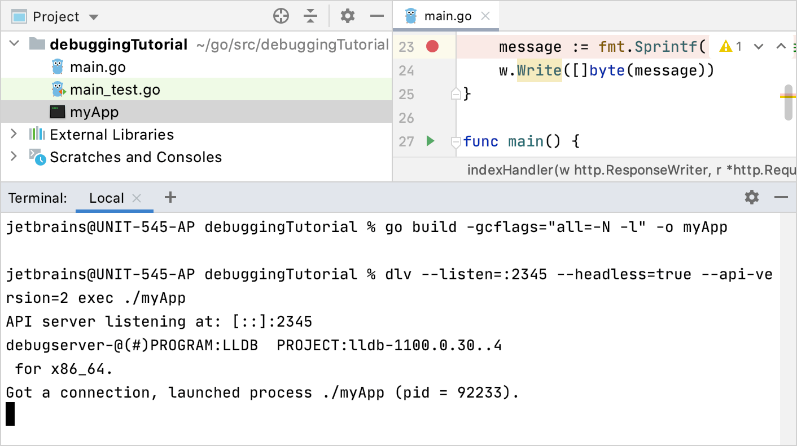

#### 3. 在客户端计算机上创建 Go Remote 运行/调试配置

1. 单击**Edit | Run Configurations**。或者，单击工具栏上的运行/调试配置列表，然后选择**Edit Configurations**。

2. 在 **Run/Debug Configurations** 窗口中, 点击 **Add** button () and 选择 **** Go Remote****.

3. 在**Host**字段中，输入主机 IP 地址（例如，192.168.1.33）。

4. 在**Port**字段中，键入您在步骤 2 中配置的调试器端口（例如 2345）。

5. 点击**OK**

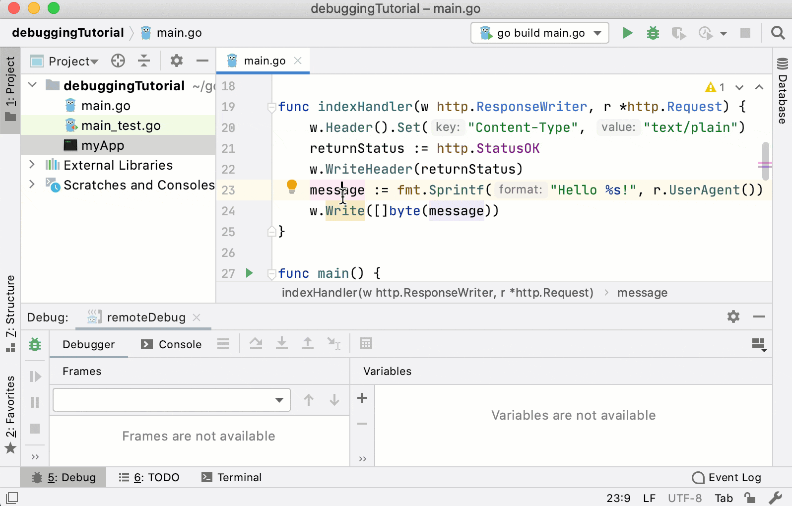

#### 4. 在客户端计算机上启动调试过程

1. 单击代码行附近的装订线以放置断点。例如，在提供的代码示例中，将断点放在第 23 行 (message := fmt.Sprintf("Hello %s!", r.UserAgent()))。在断点中阅读有关断点的更多信息。

2. 从工具栏上的运行/调试配置列表中，选择创建的 [Go Remote 配置]([Attach to running Go processes with the debugger | GoLand Documentation](https://www.jetbrains.com/help/go/attach-to-running-go-processes-with-debugger.html#step-3-create-the-remote-run-debug-configuration-on-the-client-computer))并单击“**Debug <configuration_name>**”按钮 ()。

3. 在应用程序中的断点处触发事件。如果您使用提供的[代码示例](https://github.com/apronichev/documentation-code-examples/blob/master/debuggingTutorial/main.go)，请在浏览器中打开 http://<host_address>:8080/ 链接。

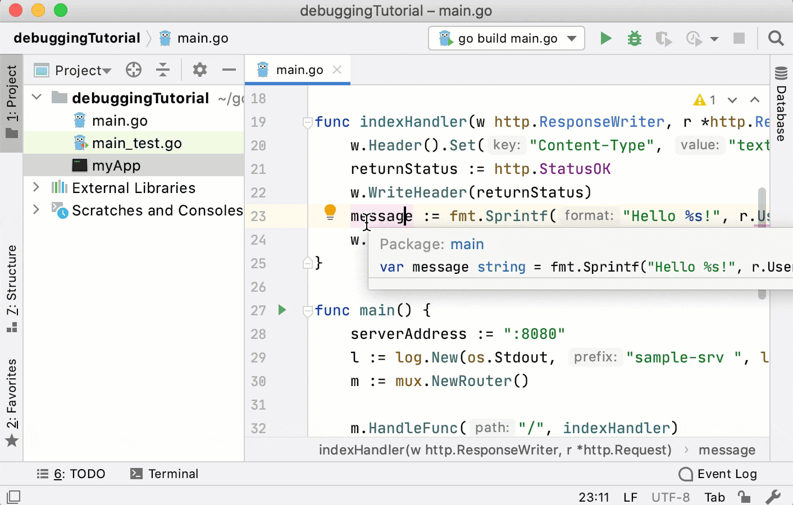

### Docker容器进程

您可以将调试器附加到在 Docker 容器中运行的 Go 进程。有关 Docker 的更多信息，请参阅 Docker。

出于示例目的，您可以为此 Go 应用程序使用以下 Dockerfile。将 **Dockerfile** 和 **main.go** 保存在 **$GOPATH/src/debuggingTutorial** 中。请注意，Dockerfile 使用debuggingTutorial 目录。如果您为项目使用不同的目录，请更改 Dockerfile 中的目录名称。

#### 1. 创建 Dockerfile 配置

1. 单击**Edit | Run Configurations**。或者，单击工具栏上的run/debug配置列表，然后选择**Edit Configurations**。

2. 在**Run/Debug Configurations**配置对话框中，单击添加按钮 () 并选择 **Docker | Dockerfile**。

3. 在 **Dockerfile** 字段中，单击**Browse**图标 () 并导航到文件浏览器中的 **Dockerfile**。如果您使用本节中的示例，请导航到此 [Dockerfile](https://github.com/apronichev/documentation-code-examples/blob/master/debuggingTutorial/Dockerfile)。

4. 在 **Container name**字段中，输入容器名称（例如，debugging-tutorial.txt）。

5. 在**Bind port**s字段中，单击**Browse**图标 ()。单击**Add**按钮 ()。在“主机端口”列中，键入 8080。单击“**Container port**”列，键入 8080。此外，为端口 40000 添加相同的绑定。

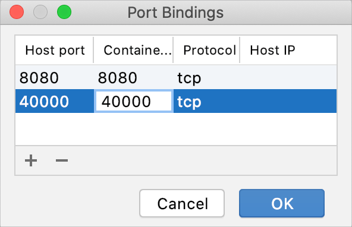

6. 在**Run options**字段中，指定 Docker 的命令行选项。对于 Dockerfile 中提供的示例，禁用安全配置文件并添加 SYS_PTRACE Linux 功能。

```go
--security-opt="apparmor=unconfined" --cap-add=SYS_PTRACE
```

7. 点击**OK**

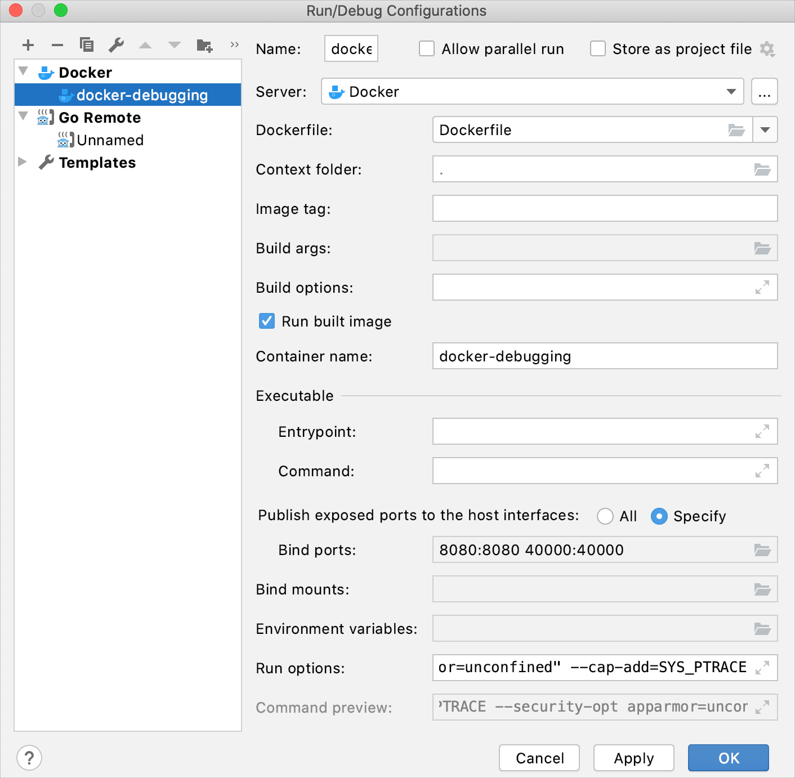

#### 2. 运行 Dockerfile 配置

从工具栏上的 **run/debug configurations** 列表中，选择创建的 Dockerfile 配置并单击 **Run <configuration_name>** 按钮()

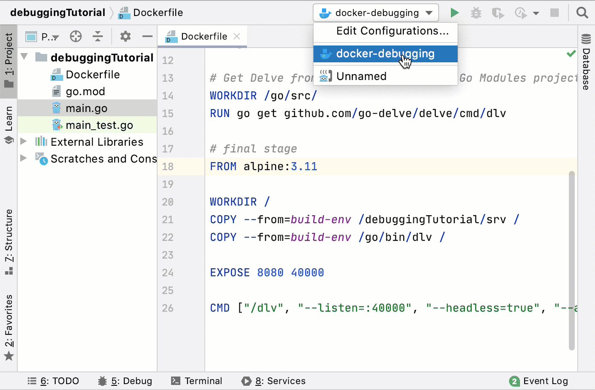

#### 3. 创建 Go Remote 运行/调试配置

1. 单击**Edit | Run Configurations**。或者，单击工具栏上的运行/调试配置列表，然后选择 **Edit Configurations**。

2. 在“**Run/Debug Configurations**”对话框中，单击“添加”按钮 () 并选择“**Go Remote**”。

3. 在**Host**字段中，键入主机 IP 地址（例如 localhost）。

4. 在**Port**字段中，键入您配置的调试器端口。在提供的示例中，该值为 40000。

5. 点击“**OK**”

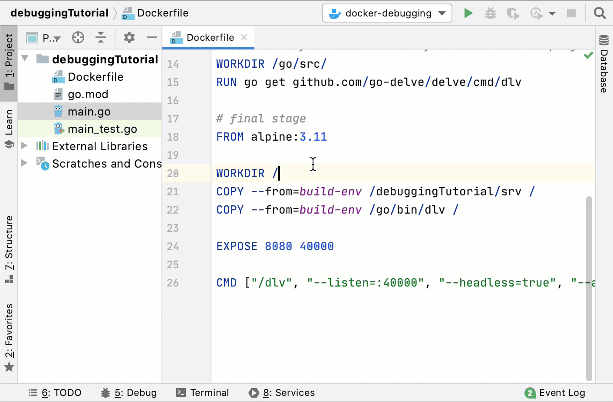

#### 4. 启动调试过程

1. 在“**Services**”工具窗口（**View | Tool Windows | Services**）中，展开**Docker | Containers**。容器。确保创建的容器正在运行并侦听预配置的调试器端口。

2. 单击代码行附近的装订线以放置断点。例如，在提供的代码示例中，将断点放在第 23 行 (message := fmt.Sprintf("Hello %s!", r.UserAgent()))。在断点中阅读有关断点的更多信息。

3. 从工具栏上的**run/debug configurations**列表中，选择[the created Go Remote configuration](https://www.jetbrains.com/help/go/attach-to-running-go-processes-with-debugger.html#step-3-create-the-go-remote-run-debug-configuration)，然后单击“Debug <configuration_name>”按钮 ()。

        或者用快捷键`⌃Ctrl``⌥Opt``D`,the created Go Remote configuration

4. 在应用程序中的断点处触发事件。如果您使用提供的 [the provided code example](https://github.com/apronichev/documentation-code-examples/blob/master/debuggingTutorial/main.go)，请在浏览器中打开 http://localhost:8080/ 链接。

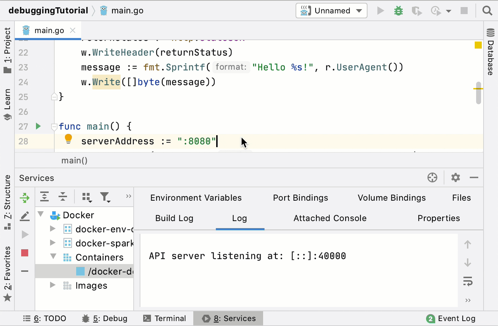

## 技巧

### 终止远程进程

您可以按 `⌘Сmd``F2`在远程调试会话期间终止远程进程。请注意，终止进程后您无法重新连接该进程。

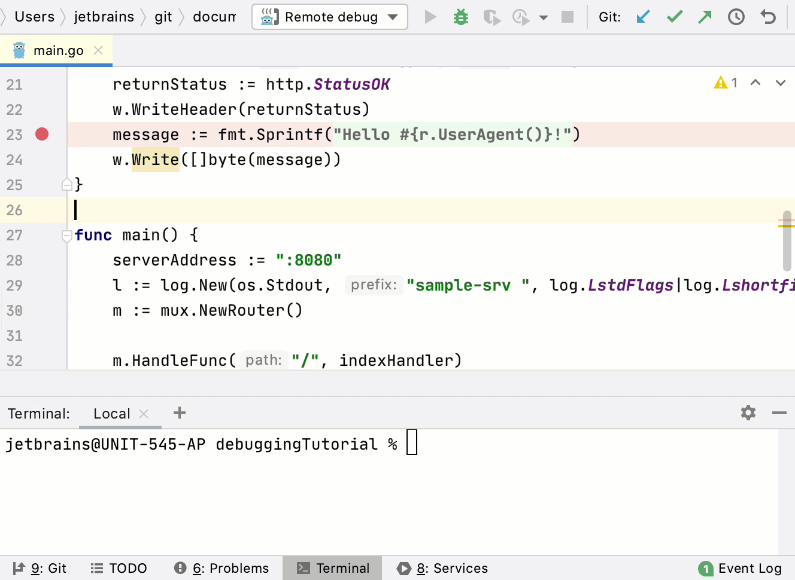

## 参考

   1. [GitHub - go-delve/delve: Delve is a debugger for the Go programming language.](https://github.com/go-delve/delve)

2. [Attach to running Go processes with the debugger | GoLand Documentation](https://www.jetbrains.com/help/go/attach-to-running-go-processes-with-debugger.html)
3. [go build](../Go-Tools/build.md)
4. https://github.com/go-delve/delve/blob/c4a10ecb167219f9a02d8b0ab07a780fc8508e62/Documentation/api/README.md
5. https://github.com/go-delve/delve/blob/c4a10ecb167219f9a02d8b0ab07a780fc8508e62/Documentation/usage/dlv_attach.md
