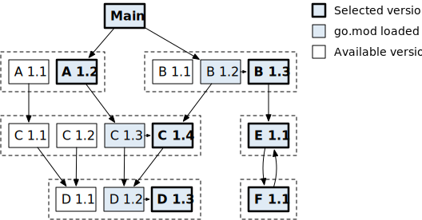
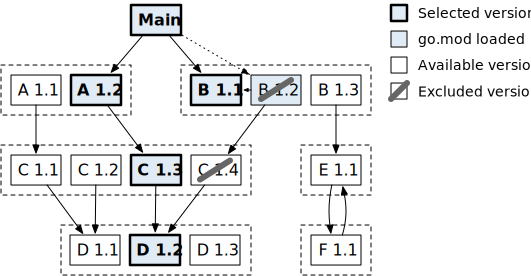
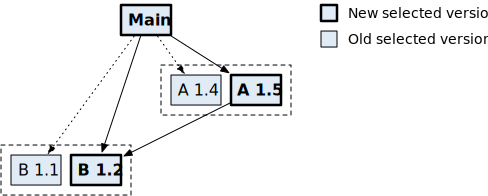
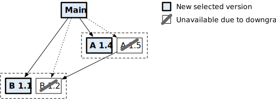

# Go Modules Reference<sub>[https://go.dev/ref/mod]([Go Modules Reference - The Go Programming Language](https://go.dev/ref/mod))</sub>

## 介绍

模块是 Go 管理依赖关系的方式。

本文档是 Go 模块系统的详细参考手册。有关创建 Go 项目的介绍，请参阅如何编写 Go 代码[How to Write Go Code](https://go.dev/doc/code.html).。有关使用模块、将项目迁移到模块以及其他主题的信息，请参阅从[Using Go Modules](https://blog.golang.org/using-go-modules)。

## Module 模块、Package包和 Version 版本

module 模块是一起发布、版本控制和分发的包的集合。模块可以直接从版本控制存储库或模块代理服务器下载。

模块由[模块路径](https://go.dev/ref/mod#glos-module-path)（在 go.mod 文件中声明）以及有关模块依赖项的信息来标识。模块根目录是包含 go.mod 文件的目录。主模块是包含调用 go 命令的目录的模块。

模块中的每个包都是同一目录中编译在一起的源文件的集合。包路径是与包含包的子目录连接的模块路径（相对于模块根）。例如，模块“golang.org/x/net”包含目录“html”中的包。该包的路径是“golang.org/x/net/html”。

### Module paths 模块路径

模块路径module path是模块的规范名称，在模块的 go.mod 文件中使用 module 指令声明。<mark>模块的路径是模块内包路径的前缀</mark>。

模块路径应该描述<mark>模块的功能</mark>以及在<mark>哪里可以找到它</mark>。通常，模块路径由存储库根路径、存储库中的目录（通常为空）和主版本后缀（仅适用于主要版本 2 或更高版本）组成。

- *存储库根路径*是模块路径的一部分，对应于开发模块的版本控制存储库的根目录。大多数模块都是在其存储库的根目录中定义的，因此这通常是整个路径。例如，golang.org/x/net 是同名模块的存储库根路径。有关 go 命令如何使用从模块路径派生的 HTTP 请求来查找存储库的信息，请参阅查找模块路径的存储库[Finding a repository for a module path](https://go.dev/ref/mod#vcs-find)。

- 如果模块未在存储库的根目录中定义，则*模块子目录*是命名该目录的模块路径的一部分，不包括主版本后缀。这也用作语义版本标签的前缀。例如，模块 golang.org/x/tools/gopls 位于根路径为 golang.org/x/tools 的存储库的 gopls 子目录中，因此它具有模块子目录 gopls。请参阅将版本映射到存储库中的提交([Mapping versions to commits](https://go.dev/ref/mod#vcs-version))和模块目录([Module directories within a repository](https://go.dev/ref/mod#vcs-dir))。

- 如果模块以主版本 2 或更高版本发布，则模块路径必须以<mark>主版本后缀（如 /v2）</mark>结尾。这可能是也可能不是子目录名称的一部分。例如，路径为 golang.org/x/repo/sub/v2 的模块可能位于存储库 golang.org/x/repo 的 /sub 或 /sub/v2 子目录中。

如果某个模块可能被其他模块依赖，则必须遵循这些规则，以便 go 命令可以找到并下载该模块。模块路径中允许的字符也有一些词法限制[lexical restrictions](https://go.dev/ref/mod#go-mod-file-ident)。

### Versions 版本

*版本version*标识*模块的不可变快照*，可以是发行版 [release](https://go.dev/ref/mod#glos-release-version)或预发行版[pre-release](https://go.dev/ref/mod#glos-pre-release-version)。每个版本都以字母 v 开头，后跟语义版本。有关如何格式化、解释和比较版本的详细信息，请参阅[Semantic Versioning 2.0.0](https://semver.org/spec/v2.0.0.html)。
概括地说，语义版本由三个非负整数（从左到右依次为主要版本、次要版本和补丁版本）组成，中间用点隔开。补丁版本后面可以是一个可选的预发布字符串，以连字符开头。在预发布字符串或补丁版本后，还可以是以加号开头的构建元数据字符串。例如，v0.0.0、v1.12.134、v8.0.5-pre 和 v2.0.9+meta 都是有效的版本。

版本的每个部分都表明该版本是否稳定，是否与以前的版本兼容。

- 在对模块的公共接口或记录的功能进行向后不兼容的更改后（例如，删除包后），必须递增主要版本[major version](https://go.dev/ref/mod#glos-major-version)，并且必须将次要版本和补丁版本设置为零。

- 在向后兼容的更改之后（例如，在添加新功能之后），必须递增次要版本[minor version](https://go.dev/ref/mod#glos-minor-version)并将补丁版本设置为零。

- 在不影响模块公共接口的更改（例如错误修复或优化）之后，必须增加补丁版本[patch version](https://go.dev/ref/mod#glos-patch-version)。

- 预发布后缀[pre-release](https://go.dev/ref/mod#glos-pre-release-version)表示版本是预发布的。预发布版本排序在相应的发布版本之前。例如，v1.2.3-pre 出现在 v1.2.3 之前。

- 为了比较版本，构建元数据后缀将被忽略。版本控制存储库中会忽略带有构建元数据的标签，但构建元数据会保留在 go.mod 文件中指定的版本中。后缀+不兼容表示迁移到模块版本主要版本2或更高版本之前发布的版本[Go Modules Reference - The Go Programming Language](https://go.dev/ref/mod#non-module-compat)

如果版本的主要版本为 0 或具有预发布后缀，则该版本被视为不稳定。不稳定版本不受兼容性要求的约束。例如，v0.2.0 可能与 v0.1.0 不兼容，v1.5.0-beta 可能与 v1.5.0 不兼容。

Go 可以使用不遵循这些约定的标签、分支或修订来访问版本控制系统中的模块。但是，在主模块中，go 命令会自动将不遵循此标准的修订名称转换为规范版本。作为此过程的一部分，go 命令还将删除构建元数据后缀（+incompatible）。这可能会产生伪版本[pseudo-version](https://go.dev/ref/mod#glos-pseudo-version)、对修订标识符（例如Git commit hash）和来自版本控制系统的时间戳进行编码的预发布版本。例如，命令 go get golang.org/x/net@daa7c041 会将提交哈希 daa7c041 转换为伪版本 v0.0.0-20191109021931-daa7c04131f5。主模块之外需要规范版本，如果 go.mod 文件中出现像 master 这样的非规范版本，go 命令将报告错误。

### Pseudo-versions 伪版本

伪版本*pseudo-version*是一种特殊格式的预发布版本[pre-release](https://go.dev/ref/mod#glos-pre-release-version) [version](https://go.dev/ref/mod#glos-version)，它对版本控制存储库中特定修订的信息进行编码。例如，v0.0.0-20191109021931-daa7c04131f5是一个伪版本。

伪版本可以指没有可用的语义版本标签的修订。它们可用于在创建版本标签之前测试提交，例如在开发分支上。

每个伪版本由三部分组成：

- 基本版本前缀（vX.0.0 或 vX.Y.Z-0），源自修订版之前的语义版本标签，或者源自 vX.0.0（如果没有此类标签）。

- 时间戳 (yyyymmddhhmmss)，这是创建修订版的 UTC 时间。在 Git 中，这是提交时间，而不是作者时间。

- 修订标识符 (abcdefabcdef)，它是提交哈希的 12 个字符前缀，或者在 Subversion 中是一个零填充的修订号。

每个伪版本可能采用三种形式之一，具体取决于基本版本。这些形式确保伪版本比其基本版本更高，但比下一个标记版本低。

- 当没有已知的基本版本时，使用 vX.0.0-yyyymmddhhmmss-abcdefabcdef。与所有版本一样，主版本 X 必须与模块的主版本后缀匹配。

- 当基础版本是像 vX.Y.Z-pre 这样的预发布版本时，使用 vX.Y.Z-pre.0.yyyymmddhhmmss-abcdefabcdef。

- 当基础版本是像 vX.Y.Z 这样的发布版本时，使用 vX.Y.(Z+1)-0.yyyymmddhhmmss-abcdefabcdef。例如，如果基本版本是 v1.2.3，则伪版本可能是 v1.2.4-0.20191109021931-daa7c04131f5。

多个伪版本可能通过使用不同的基本版本来引用相同的提交。当写入伪版本后标记较低版本时，这种情况自然会发生。

这些形式为伪版本提供了两个有用的属性：

- 具有已知基本版本的伪版本排序高于这些版本，但低于后续版本的其他预发布版本。

- 具有相同基本版本前缀的伪版本按时间顺序排序。

go 命令执行多项检查，以确保模块作者可以控制如何将伪版本与其他版本进行比较，并且伪版本引用实际上是模块提交历史记录一部分的修订。

- 如果指定了基本版本，则必须有一个相应的语义版本标记，该标记是伪版本所描述的修订版本的祖先。这可以防止开发人员使用比所有标记版本（例如 v1.999.999-99999999999999-daa7c04131f5）更高的伪版本来绕过[minimal version selection](https://go.dev/ref/mod#glos-minimal-version-selection)。

- 时间戳必须与修订版本的时间戳相匹配。这可以防止攻击者用无限数量的相同伪版本淹没模块代理。这也可以防止模块使用者更改版本的相对顺序。

- 修订版本必须是模块存储库的分支或标签之一的祖先。这可以防止攻击者引用未经批准的更改或拉取请求。

伪版本永远不需要手动输入。许多命令接受提交哈希或分支名称，并自动将其转换为伪版本（或标记版本，如果可用）。例如：

```shell
go get example.com/mod@master
go list -m -json example.com/mod@abcd1234
```

### Major version suffixes 主要版本后缀

从主要版本 2 开始，模块路径必须具有与主要版本匹配的主要版本后缀，例如 /v2。例如，如果模块在 v1.0.0 处具有路径 example.com/mod，则在版本 v2.0.0 处它必须具有路径 example.com/mod/v2。

主要版本后缀实现导入兼容性规则[import compatibility rule](https://research.swtch.com/vgo-import)：

> 如果旧包和新包具有相同的导入路径，则新包必须向后兼容旧包。

根据定义，模块的新主要版本中的包不向后兼容先前主要版本中的相应包。因此，从 v2 开始，包需要新的导入路径。这是通过向模块路径添加主要版本后缀来完成的。由于模块路径是模块内每个包的导入路径的前缀，因此将主要版本后缀添加到模块路径可为每个不兼容的版本提供不同的导入路径。

主要版本 v0 或 v1 不允许使用主要版本后缀。 v0和v1之间不需要更改模块路径，因为v0版本不稳定并且没有兼容性保证。此外，对于大多数模块，v1 向后兼容最新的 v0 版本； v1 版本充当对兼容性的承诺，而不是表示与 v0 相比不兼容的更改。

作为一种特殊情况，以 gopkg.in/ 开头的模块路径必须始终具有主版本后缀，即使是 v0 和 v1。后缀必须以点而不是斜线开头（例如 gopkg.in/yaml.v2）。

主要版本后缀允许模块的多个主要版本共存于同一构建中。由于钻石依赖性问题([diamond dependency problem](https://research.swtch.com/vgo-import#dependency_story).)，这可能是必要的。通常，如果通过传递依赖关系需要两个不同版本的模块，则将使用较高版本。但是，如果两个版本不兼容，则两个版本都无法满足所有客户的要求。由于不兼容的版本必须具有不同的主版本号，因此由于主版本后缀，它们也必须具有不同的模块路径。这解决了冲突：具有不同后缀的模块被视为单独的模块，并且它们的包（甚至相对于其模块根位于同一子目录中的包）是不同的。

许多 Go 项目在迁移到模块之前（可能甚至在引入模块之前）就发布了 v2 或更高版本，而不使用主要版本后缀。这些版本用+不兼容的构建标签进行注释（例如，v2.0.0+不兼容）。有关更多信息，请参阅与非模块存储库的兼容性([Compatibility with non-module repositories](https://go.dev/ref/mod#non-module-compat))。

### Resolving a package to a module 将包解析为模块

当 go 命令使用包路径加载包时，它需要确定哪个模块提供该包。

go 命令首先在构建列表( [build list](https://go.dev/ref/mod#glos-build-list))中搜索路径为包路径前缀的模块。例如，如果导入了包 example.com/a/b，并且模块 example.com/a 在构建列表中，则 go 命令将检查目录 b 中的 example.com/a 是否包含该包。目录中必须至少存在一个扩展名为 .go 的文件，才能将其视为包。构建约束([Build constraints](https://go.dev/pkg/go/build/#hdr-Build_Constraints))不适用于此目的。如果构建列表中恰好有一个模块提供了该包，则使用该模块。如果没有模块提供该包，或者有两个或更多模块提供该包，则 go 命令会报告错误。 -mod=mod 标志指示 go 命令尝试查找提供缺失软件包的新模块并更新 go.mod 和 go.sum。 go get 和 go mod tidy 命令会自动执行此操作。

当 go 命令查找包路径的新模块时，它会检查 GOPROXY 环境变量，该变量是代理 URL 或关键字 direct 或 off 的逗号分隔列表。代理 URL 指示 go 命令应使用 GOPROXY 协议联系模块代理。 direct 指示 go 命令应与版本控制系统通信。 off 表示不应尝试进行任何通信。 GOPRIVATE 和 GONOPROXY 环境变量也可用于控制此行为。

对于 GOPROXY 列表中的每个条目，go 命令请求可能提供包的每个模块路径的最新版本（即包路径的每个前缀）。对于每个成功请求的模块路径，go 命令都会下载最新版本的模块并检查该模块是否包含所请求的包。如果一个或多个模块包含所请求的包，则使用具有最长路径的模块。如果找到一个或多个模块，但没有一个包含所请求的包，则会报告错误。如果没有找到模块，go 命令会尝试 GOPROXY 列表中的下一个条目。如果没有留下任何条目，则会报告错误。

例如，假设 go 命令正在查找提供包 golang.org/x/net/html 的模块，并且 GOPROXY 设置为 https://corp.example.com,https://proxy.golang.org 。 go 命令可能会发出以下请求：

- 前往 https://corp.example.com/（并行）：
  
  - 请求最新版本的 golang.org/x/net/html
  
  - 请求最新版本的 golang.org/x/net
  
  - 请求最新版本的 golang.org/x
  
  - 请求最新版本的 golang.org

- 对于 https://proxy.golang.org/，如果对 https://corp.example.com/ 的所有请求都失败并返回 404 或 410：
  
  - 请求最新版本的 golang.org/x/net/html
  
  - 请求最新版本的 golang.org/x/net
  
  - 请求最新版本的 golang.org/x
  
  - 请求最新版本的 golang.org

找到合适的模块后，go 命令会将新的需求([requirement](https://go.dev/ref/mod#go-mod-file-require))以及新模块的路径和版本添加到主模块的 go.mod 文件中。这保证了以后加载相同的包时，相同的版本会使用相同的模块。如果解析的包不是由主模块中的包导入的，则新需求将有 ***// indirect***。

## go.mod 文件

一个模块由utf-8编码的文本文件定义，其根目录中名为go.mod。 go.mod文件是面向行的。每行都有一个指令，由关键字组成，然后是参数。例如：

```go-mod
module example.com/my/thing

go 1.12

require example.com/other/thing v1.0.2
require example.com/new/thing/v2 v2.3.4
exclude example.com/old/thing v1.2.3
replace example.com/bad/thing v1.4.5 => example.com/good/thing v1.4.5
retract [v1.9.0, v1.9.5]
```

前导关键字可以从相邻行中分解出来以创建一个块，就像在 Go 导入中一样。

```go-mod
require (
    example.com/new/thing/v2 v2.3.4
    example.com/old/thing v1.2.3
)
```

go.mod 文件被设计为人类可读且机器可写。 go 命令提供了几个更改 go.mod 文件的子命令。例如，go get 可以升级或降级特定的依赖项。加载模块图的命令将在需要时自动更新 go.mod。 go mod edit 可以执行低级编辑。 Go 程序可以使用 golang.org/x/mod/modfile 包以编程方式进行相同的更改。

主模块([main module](https://go.dev/ref/mod#glos-main-module))以及使用本地文件路径指定的任何替换模块([replacement module](https://go.dev/ref/mod#go-mod-file-replace))都需要 go.mod 文件。但是，缺少显式 go.mod 文件的模块可能仍需要作为依赖项( [required](https://go.dev/ref/mod#go-mod-file-require))，或用作使用模块路径和版本指定的替换；请参阅与非模块存储库的兼容性([Compatibility with non-module repositories](https://go.dev/ref/mod#non-module-compat).)。

### Lexical elements 元素

当解析 go.mod 文件时，其内容被分解为一系列标记。有多种标记：空格、注释、标点符号、关键字、标识符和字符串。

空白由空格 (U+0020)、制表符 (U+0009)、回车符 (U+000D) 和换行符 (U+000A) 组成。除了换行符之外的空白字符没有任何作用，除非可以分隔本来要组合的标记。换行符是重要的标记。

注释以 // 开始，一直到行尾。 /* */ 不允许注释。

标点符号包括 (、) 和 =>。

关键字区分 go.mod 文件中不同类型的指令。允许的关键字包括 module、go、require、replace、exclusion 和撤回。

标识符是非空白字符的序列，例如模块路径或语义版本。

字符串是带引号的字符序列。有两种字符串：以引号开头和结尾的解释字符串 (", U+0022) 和以重音符号开头和结尾的原始字符串 (`, U+0060)。解释字符串可能包含由反斜杠 ( \, U+005C) 后跟另一个字符。转义引号 (\") 不会终止解释的字符串。解释字符串的不带引号的值是引号之间的字符序列，每个转义序列都替换为反斜杠后面的字符（例如，\" 替换为 "，\n 替换为 n）。相反，原始字符串的未加引号的值只是重音符号之间的字符序列；反斜杠在原始字符串中没有特殊含义。

标识符和字符串在 go.mod 语法中是可以互换的。

### Module paths and versions 模块路径和版本

go.mod 文件中的大多数标识符和字符串都是模块路径或版本。

模块路径必须满足以下要求：

- 该路径必须由一个或多个以斜杠（/、U+002F）分隔的路径元素组成。它不能以斜线开头或结尾。

- 每个路径元素都是一个由 ASCII 字母、ASCII 数字和有限的 ASCII 标点符号（-、.、_ 和 ~）组成的非空字符串。

- 路径元素不能以点 (., U+002E) 开头或结尾。

- 第一个点之前的元素前缀不得是 Windows 上的保留文件名，无论大小写（CON、com1、NuL 等）。

- 第一个点之前的元素前缀不得以波浪号后跟一个或多个数字结尾（如 EXAMPL~1.COM）。

如果模块路径出现在 require 指令中并且未被替换，或者模块路径出现在 replace 指令的右侧，则 go 命令可能需要使用该路径下载模块，并且必须满足一些附加要求。

- 按照惯例，前导路径元素（直到第一个斜杠，如果有）必须仅包含小写 ASCII 字母、ASCII 数字、点 (.、U+002E) 和破折号 (-、U+002D) ）；它必须至少包含一个点并且不能以破折号开头。

- 对于 /vN 形式的最终路径元素，其中 N 看起来是数字（ASCII 数字和点），N 不能以前导零开头，不能是 /v1，并且不能包含任何点。
  
  - 对于以 gopkg.in/ 开头的路径，此要求被路径遵循 gopkg.in 服务约定的要求所取代。

go.mod 文件中的版本可能是规范的([canonical](https://go.dev/ref/mod#glos-canonical-version))或非规范的。

规范版本以字母 v 开头，后跟遵循语义版本 2.0.0 规范的语义版本。有关详细信息，请参阅版本。

大多数其他标识符和字符串可以用作非规范版本，但有一些限制以避免文件系统、存储库和模块代理出现问题。非规范版本仅允许在主模块的 go.mod 文件中使用。当 go 命令自动更新 go.mod 文件时，它会尝试将每个非规范版本替换为等效的规范版本。

在模块路径与版本关联的地方（如 require、replace 和 except 指令），最终路径元素必须与版本一致。请参阅主要版本后缀([Major version suffixes](https://go.dev/ref/mod#major-version-suffixes))。

### Grammar 语法

go.mod 语法在下面使用扩展巴科斯-诺尔范式 (EBNF) 指定。有关 EBNF 语法的详细信息，请参阅 Go 语言规范中的符号部分。

```ebnf
GoMod = { Directive } .
Directive = ModuleDirective |
            GoDirective |
            RequireDirective |
            ExcludeDirective |
            ReplaceDirective |
            RetractDirective .
```

换行符、标识符和字符串分别用 newline、ident 和 string 表示。

模块路径和版本用 ModulePath 和 Version 表示。

```ebnf
ModulePath = ident | string . /* see restrictions above */
Version = ident | string .    /* see restrictions above */
```

### module directive 模块指令

模块指令定义主模块的路径([path](https://go.dev/ref/mod#glos-module-path))。 go.mod 文件必须恰好包含一个模块指令。

```ebnf
ModuleDirective = "module" ( ModulePath | "(" newline ModulePath newline ")" ) newline .
```

例如：

```go-mod
module golang.org/x/net
```

### Deprecation 弃用

可以在段落开头包含字符串 Deprecated:（区分大小写）的注释块中将模块标记为已弃用。弃用消息在冒号之后开始，一直到段落末尾。注释可能出现在模块指令之前，也可能出现在同一行之后。

例：

```go-mod
// Deprecated: use example.com/mod/v2 instead.
module example.com/mod
```

从 Go 1.17 开始， go list -m -u 检查构建列表中所有已弃用模块的信息。 go get 检查构建在命令行上命名的包所需的已弃用模块。

当 go 命令检索模块的弃用信息时，它会从与 @latest 版本查询匹配的版本加载 go.mod 文件，而不考虑撤回或排除。 go 命令从同一 go.mod 文件加载收回版本的列表。

要弃用模块，作者可以添加 // Deprecated: 注释并标记新版本。作者可能会在更高版本中更改或删除弃用消息。

弃用适用于模块的所有次要版本。为此，高于 v2 的主要版本被视为单独的模块，因为它们的主要版本后缀为它们提供了不同的模块路径。

弃用消息旨在通知用户该模块不再受支持，并提供迁移说明，例如迁移到最新的主要版本。个别次要版本和补丁版本不能被弃用；撤回可能更适合于此。

### go directive

go 指令指示模块是在假定给定 Go 版本的语义的情况下编写的。该版本必须是有效的 Go 版本，例如 1.9、1.14 或 1.21rc1。

go 指令设置使用该模块所需的最低 Go 版本。在 Go 1.21 之前，该指令仅是建议性的；现在这是一个强制性要求：Go 工具链拒绝使用声明较新 Go 版本的模块。

go 指令是选择要运行的 Go 工具链的输入。有关详细信息，请参阅“Go 工具链([Go toolchains](https://go.dev/doc/toolchain))”。

go 指令影响新语言功能的使用：

- 对于模块内的包，编译器拒绝使用 go 指令指定的版本之后引入的语言功能。例如，如果模块具有指令 go 1.12，则其包可能不会使用 Go 1.13 中引入的数字文字，例如 1_000_000。

- 如果较旧的 Go 版本构建该模块的某个包并遇到编译错误，该错误会指出该模块是为较新的 Go 版本编写的。例如，假设模块的版本为 1.13，而包使用数字文字 1_000_000。如果该包是使用 Go 1.12 构建的，编译器会注意到该代码是为 Go 1.13 编写的。

go 指令还会影响 go 命令的行为：

- 在 go 1.14 或更高版本中，可以启用自动[vendoring](https://go.dev/ref/mod#vendoring)。如果文件vendor/modules.txt存在并且与go.mod一致，则无需显式使用-mod=vendor标志。

- 在 go 1.16 或更高版本中，所有包模式仅匹配由主模块中的包和测试传递导入的包。这是自引入模块以来 go mod vendor保留的同一组软件包。在较低版本中，all 还包括对主模块中的包导入的包的测试、对这些包的测试等等。

- 在 go 1.17 或更高版本中：
  
  - go.mod 文件包含每个模块的显式[`require` directive](https://go.dev/ref/mod#go-mod-file-require)，该指令提供由主模块中的包或测试传递导入的任何包。 （在 go 1.16 及更低版本中，仅当最小版本选择([minimal version selection](https://go.dev/ref/mod#minimal-version-selection))会选择不同版本时才包含间接依赖项[indirect dependency](https://go.dev/ref/mod#glos-direct-dependency)。）此额外信息支持模块图修剪[module graph pruning](https://go.dev/ref/mod#graph-pruning)和延迟模块加载[lazy module loading](https://go.dev/ref/mod#lazy-loading)。
  
  - 因为可能比以前的 go 版本有更多 // 间接依赖关系，所以间接依赖关系被记录在 go.mod 文件中的单独块中。
  
  - go mod vendor 会省略 go.mod 和 go.sum 文件中的 vendored 依赖项。(这使得在 vendor 的子目录中调用 go 命令时能识别正确的主模块）。
  
  - go mod供应商在vendor/modules.txt中记录每个依赖项的go.mod文件中的go版本。

- go 1.21 或更高版本
  
  - go 行声明了与此模块一起使用所需的最低 Go 版本。
  
  - go行必须大于或等于所有依赖的go行。
  
  - go 命令不再尝试保持与之前旧版本 Go 的兼容性。
  
  - go 命令更加小心地将 go.mod 文件的校验和保存在 go.sum 文件中。

一个 go.mod 文件最多可以包含一个 go 指令。如果不存在，大多数命令都会添加包含当前 Go 版本的 go 指令。

如果缺少 go 指令，则假定为 go 1.16。

```ebnf
GoDirective = "go" GoVersion newline .
GoVersion = string | ident .  /* valid release version; see above */
```

例如：

```go-mod
go 1.14
```

### toolchain directive 工具链指令

工具链指令声明了与模块一起使用的建议 Go 工具链。建议的 Go 工具链版本不能低于 go 指令中声明的所需 Go 版本。仅当模块是主模块并且默认工具链的版本低于建议工具链的版本时，工具链指令才有效。

为了重现性，go 命令在更新 go.mod 文件中的 go 版本时（通常在 go get 期间），会在工具链行中写入自己的工具链名称。

有关详细信息，请参阅“[Go toolchains](https://go.dev/doc/toolchain)”。

```ebnf
ToolchainDirective = "toolchain" ToolchainName newline .
ToolchainName = string | ident .  /* valid toolchain name; see “Go toolchains” */
```

例如

```go-mod
toolchain go1.21.0
```

### exclude directive

排除指令可防止 go 命令加载模块版本。

从 Go 1.16 开始，如果任何 go.mod 文件中的 require 指令引用的版本被主模块的 go.mod 文件中的 except 指令排除，则该要求将被忽略。这可能会导致像 go get 和 go mod tidy 这样的命令向 go.mod 添加对更高版本的新要求，并在适当的情况下使用 // 间接注释。

在 Go 1.16 之前，如果 require 指令引用了排除版本，则 go 命令会列出该模块的可用版本（如 go list -m -versions 所示）并加载下一个更高的非排除版本。这可能会导致不确定的版本选择，因为下一个更高版本可能会随着时间而改变。发布版本和预发布版本都被考虑用于此目的，但伪版本则不然。如果没有更高的版本，go命令会报错。

except 指令仅适用于主模块的 go.mod 文件，并在其他模块中被忽略。有关详细信息，请参阅最小版本选择。

```ebnf
ExcludeDirective = "exclude" ( ExcludeSpec | "(" newline { ExcludeSpec } ")" newline ) .
ExcludeSpec = ModulePath Version newline .
```

例如：

```go-mod
exclude golang.org/x/net v1.2.3

exclude (
    golang.org/x/crypto v1.4.5
    golang.org/x/text v1.6.7
)
```

### require directive

require 指令声明给定模块依赖项的最低所需版本。对于每个所需的模块版本，go 命令会加载该版本的 go.mod 文件并合并该文件中的要求。加载所有需求后，go 命令会使用最小版本选择 (MVS [minimal version selection (MVS)](https://go.dev/ref/mod#minimal-version-selection)) 来解决它们以生成构建列表。

go 命令会针对某些需求自动添加 // 间接注释。 // 间接注释表示主模块中的任何包都不会直接导入所需模块中的包。

如果 go 指令指定 go 1.16 或更低版本，则当选定的模块版本高于主模块的其他依赖项已经暗示（传递）的版本时，go 命令会添加间接要求。发生这种情况的原因可能是显式升级 (go get -u ./...)、删除了先前施加要求的某些其他依赖项 (go mod tidy)，或者导入了自身没有相应要求的包的依赖项go.mod 文件（例如完全缺少 go.mod 文件的依赖项）。

在 go 1.17 及更高版本中，go 命令为每个模块添加了间接要求，该模块提供由主模块中的包或测试导入（甚至间接）或作为参数传递给 go get 的任何包。这些更全面的要求支持模块图修剪和延迟模块加载。

```ebnf
RequireDirective = "require" ( RequireSpec | "(" newline { RequireSpec } ")" newline ) .
RequireSpec = ModulePath Version newline .
```

例如：

```go-mod
require golang.org/x/net v1.2.3

require (
    golang.org/x/crypto v1.4.5 // indirect
    golang.org/x/text v1.6.7
)
```

### replace directive

replace指令用其他地方找到的内容替换模块的特定版本或模块的所有版本的内容。可以使用另一个模块路径和版本或特定于平台的文件路径来指定替换。

如果箭头左侧 (=>) 存在版本，则仅替换该模块的特定版本；其他版本都可以正常访问。如果省略左侧版本，则替换该模块的所有版本。

如果箭头右侧的路径是绝对或相对路径（以./或../开头），则将其解释为替换模块根目录的本地文件路径，其中必须包含go.mod文件。在这种情况下，必须省略替换版本。

如果右侧的路径不是本地路径，则它必须是有效的模块路径。在这种情况下，需要一个版本。相同的模块版本不得同时出现在构建列表中。

无论替换是使用本地路径还是模块路径指定，如果替换模块具有 go.mod 文件，则其模块指令必须与其替换的模块路径匹配。

替换指令仅适用于主模块的 go.mod 文件，并在其他模块中被忽略。有关详细信息，请参阅 [Minimal version selection](https://go.dev/ref/mod#minimal-version-selection)。

如果有多个主模块，则所有主模块的 go.mod 文件都适用。不允许主模块之间存在冲突的替换指令，并且必须在 go.work 文件的替换中删除或覆盖。

请注意，单独的替换指令不会将模块添加到模块图中。还需要在主模块的 go.mod 文件或依赖项的 go.mod 文件中引用替换模块版本的 require 指令。如果不需要左侧的模块版本，则替换指令无效。

```ebnf
ReplaceDirective = "replace" ( ReplaceSpec | "(" newline { ReplaceSpec } ")" newline ) .
ReplaceSpec = ModulePath [ Version ] "=>" FilePath newline
            | ModulePath [ Version ] "=>" ModulePath Version newline .
FilePath = /* platform-specific relative or absolute file path */
```

例如：

```go-mod
replace golang.org/x/net v1.2.3 => example.com/fork/net v1.4.5

replace (
    golang.org/x/net v1.2.3 => example.com/fork/net v1.4.5
    golang.org/x/net => example.com/fork/net v1.4.5
    golang.org/x/net v1.2.3 => ./fork/net
    golang.org/x/net => ./fork/net
)
```

### retract directive 撤回指令

撤回指令指示不应依赖 go.mod 定义的模块的版本或版本范围。当版本过早发布或版本发布后发现严重问题时，撤回指令非常有用。撤回的版本应在版本控制存储库和模块代理中保持可用，以确保依赖于它们的构建不会被破坏。 “撤回”这个词借用自学术文献：撤回的研究论文仍然可用，但它有问题，不应该成为未来工作的基础。

当模块版本被收回时，用户将不会使用 go get、go mod tidy 或其他命令自动升级到该模块版本。依赖于撤回版本的构建应该继续工作，但是当用户使用 go list -m -u 检查更新或使用 go get 更新相关模块时，用户将收到撤回通知。

要收回版本，模块作者应向 go.mod 添加收回指令，然后发布包含该指令的新版本。新版本必须高于其他发布或预发布版本；也就是说，@latest [version query](https://go.dev/ref/mod#version-queries)应在考虑撤回之前解析为新版本。 go 命令加载并应用 go list -m -retracted $modpath@latest 显示的版本的撤回（其中 $modpath 是模块路径）。

除非使用 -retracted 标志，否则收回的版本将从 go list -m -versions 打印的版本列表中隐藏。解析 @>=v1.2.3 或 @latest 等版本查询时，将排除已收回的版本。

包含撤回的版本可能会自行撤回。如果模块的最高版本或预发布版本自行收回，则在排除收回的版本后，@latest 查询将解析为较低版本。

例如，考虑模块 example.com/m 的作者意外发布版本 v1.0.0 的情况。为了防止用户升级到 v1.0.0，作者可以在 go.mod 中添加两个撤回指令，然后用撤回标记 v1.0.1。

```go-mod
retract (
    v1.0.0 // Published accidentally.
    v1.0.1 // Contains retractions only.
)
```

当用户运行 go get example.com/m@latest 时，go 命令会读取 v1.0.1（现在是最高版本）的撤回内容。 v1.0.0 和 v1.0.1 都已撤销，因此 go 命令将升级（或降级！）到下一个最高版本，可能是 v0.9.5。

撤消指令可以使用单个版本（如 v1.0.0）或具有上限和下限的封闭版本间隔编写，由 [ 和 ] 分隔（如 [v1.1.0, v1.2.0]）。单一版本相当于上限和下限相同的区间。与其他指令一样，多个撤回指令可以组合在一个块中，该块由 ( 在行尾和 ) 分隔在其自己的行上。

每个撤回指令都应有一条注释，解释撤回的理由，但这不是强制性的。 go 命令可能会在有关撤回版本的警告和 go 列表输出中显示基本原理注释。基本原理注释可以直接写在撤消指令上方（中间没有空行），也可以写在同一行之后。如果注释出现在块上方，则它适用于该块内没有自己注释的所有撤回指令。理由注释可以跨越多行。

```ebnf
RetractDirective = "retract" ( RetractSpec | "(" newline { RetractSpec } ")" newline ) .
RetractSpec = ( Version | "[" Version "," Version "]" ) newline .
```

例如：

- 收回 v1.0.0 和 v1.9.9 之间的所有版本：

```go-mod
retract v1.0.0
retract [v1.0.0, v1.9.9]
retract (
    v1.0.0
    [v1.0.0, v1.9.9]
)
```

- 在过早发布版本 v1.0.0 后返回到无版本控制：

```go-mod
retract [v0.0.0, v1.0.1] // assuming v1.0.1 contains this retraction.
```

- 清除包含所有伪版本和标记版本的模块：

```go-mod
retract [v0.0.0-0, v0.15.2]  // assuming v0.15.2 contains this retraction.
```

撤销指令是在<mark> Go 1.16 中添加</mark>的。 Go 1.15及更低版本如果在主模块的go.mod文件中写入retract指令会报告错误，并且会忽略依赖项的go.mod文件中的retract指令。

### Automatic updates

如果 go.mod 缺少信息或没有准确反映现实，大多数命令都会报告错误。 go get 和 go mod tidy 命令可用于解决大多数此类问题。此外，**-mod=mod 标志可以与大多数模块感知命​​令（go build、go test 等）一起使用**，以指示 go 命令自动修复 go.mod 和 go.sum 中的问题。

例如，考虑这个 go.mod 文件：

```go-mod
module example.com/M

go 1.16

require (
    example.com/A v1
    example.com/B v1.0.0
    example.com/C v1.0.0
    example.com/D v1.2.3
    example.com/E dev
)

exclude example.com/D v1.2.3
```

使用 -mod=mod 触发的更新将非规范版本标识符重写为规范 semver 形式，因此 example.com/A 的 v1 变为 v1.0.0，example.com/E 的 dev 变为 dev 上最新提交的伪版本分支，可能是 v0.0.0-20180523231146-b3f5c0f6e5f1。

此更新修改了要求以尊重排除，因此对排除的 example.com/D v1.2.3 的要求更新为使用 example.com/D 的下一个可用版本，可能是 v1.2.4 或 v1.3.0。

该更新删除了多余或误导性的要求。例如，如果 example.com/A v1.0.0 本身需要 example.com/B v1.2.0 和 example.com/C v1.0.0，那么 go.mod 对 example.com/B v1.0.0 的要求会产生误导（已被取代） example.com/A 需要 v1.2.0），而 example.com/C v1.0.0 的要求是多余的（暗示 example.com/A 需要相同版本），因此两者都将被删除。如果主模块包含直接从 example.com/B 或 example.com/C 导入包的包，则需求将保留，但更新为实际使用的版本。

最后，更新以规范格式重新格式化 go.mod，以便未来的机械更改将导致最小的差异。如果只需要更改格式，go 命令不会更新 go.mod。

因为模块图定义了 import 语句的含义，所以任何加载包的命令也使用 go.mod，因此可以更新它，包括 go build、go get、go install、go list、go test、go mod tidy。

在 Go 1.15 及更低版本中，默认启用 -mod=mod 标志，因此会自动执行更新。从 Go 1.16 开始，go 命令的行为就像设置了 -mod=readonly 一样：如果需要对 go.mod 进行任何更改，go 命令会报告错误并建议修复。

## Minimal version selection (MVS) 最小版本选择

Go 使用一种称为最小版本选择 (MVS) 的算法来选择构建包时要使用的一组模块版本。 MVS 在 Russ Cox 的《[Minimal Version Selection](https://research.swtch.com/vgo-mvs)》中进行了详细描述。

从概念上讲，MVS 在由 go.mod 文件指定的模块有向图上运行。图中的每个顶点代表一个模块版本。每条边代表依赖项的最低所需版本，使用 require 指令指定。该图可以通过主模块的 go.mod 文件中的排除和替换指令以及 go.work 文件中的替换指令进行修改。

MVS 生成构建列表([build list](https://go.dev/ref/mod#glos-build-list))作为输出，即用于构建的模块版本列表。

MVS 从主模块（图中没有版本的特殊顶点）开始并遍历图，跟踪每个模块所需的最高版本。在遍历结束时，最高要求的版本构成构建列表：它们是满足所有要求的最低版本。

可以使用命令 go list -m all 检查构建列表。与其他依赖管理系统不同，构建列表不保存在“锁”文件中。 MVS 是确定性的，当新版本的依赖项发布时，构建列表不会改变，因此 MVS 用于在每个模块感知命​​令的开始处计算它。

考虑下图中的示例。主模块需要1.2或更高版本的模块A和1.2或更高版本的模块B。 A 1.2 和 B 1.2 分别需要 C 1.3 和 C 1.4。 C 1.3 和 C 1.4 都需要 D 1.2。


MVS 访问并加载每个以蓝色突出显示的模块版本的 go.mod 文件。在图遍历结束时，MVS 返回包含粗体版本的构建列表：A 1.2、B 1.2、C 1.4 和 D 1.2。请注意，可以使用更高版本的 B 和 D，但 MVS 不会选择它们，因为没有什么需要它们。

### Replacement 替换

模块的内容（包括其 go.mod 文件）可以使用主模块的 go.mod 文件或工作区的 go.work 文件中的替换指令进行替换。替换指令可以应用于模块的特定版本或模块的所有版本。

替换会更改模块图，因为替换模块可能具有与替换版本不同的依赖项。

考虑下面的示例，其中 C 1.4 已替换为 R。R 依赖于 D 1.3 而不是 D 1.2，因此 MVS 返回包含 A 1.2、B 1.2、C 1.4（替换为 R）和 D 1.3 的构建列表。


### Exclusion 排除

还可以使用主模块的 go.mod 文件中的排除指令在特定版本中排除模块。

排除也会改变模块图。当某个版本被排除时，它将从模块图中删除，并且对其的要求将被重定向到下一个更高的版本。

考虑下面的例子。 C 1.3 已被排除。 MVS 将表现为 A 1.2 需要 C 1.4（下一个更高版本）而不是 C 1.3。


### Upgrades 升级版本

go get 命令可用于升级一组模块。要执行升级，go 命令会在运行 MVS 之前通过将已访问版本的边添加到升级版本来更改模块图。

考虑下面的例子。模块B可以从1.2升级到1.3，C可以从1.3升级到1.4，模块D可以从1.2升级到1.3。



升级（和降级）可能会添加或删除间接依赖项。在这种情况下，升级后，E 1.1 和 F 1.1 会出现在构建列表中，因为 B 1.3 需要 E 1.1。

为了保留升级，go 命令更新了 go.mod 中的要求。它将把 B 的要求更改为 1.3 版本。它还将通过 // 间接注释添加对 C 1.4 和 D 1.3 的要求，因为否则不会选择这些版本。

### Downgrade 降级版本

go get 命令也可用于降级一组模块。要执行降级，go 命令通过删除降级版本之上的版本来更改模块图。它还删除依赖于已删除版本的其他模块的版本，因为它们可能与其依赖项的降级版本不兼容。如果主模块需要通过降级删除的模块版本，则要求更改为尚未删除的先前版本。如果没有可用的先前版本，则删除该要求。

考虑下面的例子。假设发现 C 1.4 存在问题，因此我们降级到 C 1.3。 C 1.4 已从模块图中删除。 B 1.2 也被删除，因为它需要 C 1.4 或更高版本。主模块对B的要求改为1.1。



go get 还可以完全删除依赖项，在参数后使用 @none 后缀。这与降级类似。指定模块的所有版本都将从模块图中删除。

## Module graph pruning 模块图修剪

如果主模块为 go 1.17 或更高版本，则用于最小版本选择的模块图仅包含在其自己的 go.mod 文件中指定 go 1.17 或更高版本的每个模块依赖项的直接要求，除非该版本的模块也是（传递地）go 1.16 或更低版本的某些其他依赖项需要。 （go 1.17 依赖项的传递依赖项已从模块图中删除。）

由于 go 1.17 go.mod 文件包含在该模块中构建任何包或测试所需的每个依赖项的 require 指令，因此修剪后的模块图包含 go build 或 go test 明确要求的任何依赖项中的包所需的所有依赖项主模块。在给定模块中构建任何包或测试不需要的模块不会影响其包的运行时行为，因此从模块图中删除的依赖项只会导致其他不相关的模块之间的干扰。

其需求已被删除的模块仍然出现在模块图中，并且仍然由 go list -m all 报告：它们选择的版本是已知的并且定义良好，并且可以从这些模块加载包（例如，作为传递依赖项从其他模块加载的测试）。然而，由于 go 命令无法轻松识别满足这些模块的哪些依赖关系，因此 go build 和 go test 的参数不能包含来自其需求已被删除的模块的包。 go get 将包含每个命名包的模块提升为显式依赖项，允许在该包上调用 go build 或 go test。

由于 Go 1.16 及更早版本不支持模块图修剪，因此指定 go 1.16 或更低版本的每个模块仍包含依赖关系的完整传递闭包（包括传递 go 1.17 依赖关系）。 （在 go 1.16 及更低版本中，go.mod 文件仅包含直接依赖项，因此必须加载更大的图以确保包含所有间接依赖项。）

默认情况下，go mod tidy 为模块记录的 go.sum 文件包含低于其 go 指令中指定版本的 Go 版本所需的校验和。因此，go 1.17 模块包含 Go 1.16 加载的完整模块图所需的校验和，但 go 1.18 模块将仅包含 Go 1.17 加载的修剪模块图所需的校验和。 -compat 标志可用于覆盖默认版本（例如，在 go 1.17 模块中更积极地修剪 go.sum 文件）。

更多细节请参见设计文档( [the design document](https://go.googlesource.com/proposal/+/master/design/36460-lazy-module-loading.md))。

### Lazy module loading

为模块图修剪添加的更全面的要求还可以在模块内工作时实现另一种优化。如果主模块是 go 1.17 或更高版本，则 go 命令会避免加载完整的模块图，直到（除非）需要它。相反，它仅加载主模块的 go.mod 文件，然后尝试加载仅使用这些要求构建的包。如果在这些需求中没有找到要导入的包（例如，对主模块外部的包的测试的依赖项），则根据需要加载模块图的其余部分。

如果可以在不加载模块图的情况下找到所有导入的包，则 go 命令将仅加载包含这些包的模块的 go.mod 文件，并根据主模块的要求检查它们的要求，以确保它们在本地一致。 （由于版本控制合并、手动编辑以及使用本地文件系统路径替换的模块的更改，可能会出现不一致。）

## Workspaces 工作空间

工作区是磁盘上的模块集合，在运行最小版本选择 (MVS) 时用作主模块。

可以在 go.work 文件中声明工作空间，该文件指定工作空间中每个模块的模块目录的相对路径。当不存在 go.work 文件时，工作区由包含当前目录的单个模块组成。

大多数与模块一起使用的 go 子命令都对当前工作区确定的模块集进行操作。 go mod init、go modwhy、gomodedit、gomodtidy、gomodvendor 和 goget 始终在单个主模块上运行。

命令通过首先检查 GOWORK 环境变量来确定它是否位于工作区上下文中。如果 **GOWORK** 设置为关闭，该命令将位于单模块上下文中。如果为空或未提供，该命令将搜索当前工作目录，然后是连续的父目录，以查找文件 go.work。如果找到文件，该命令将在它定义的工作空间中运行；否则，工作区将仅包含包含工作目录的模块。如果 GOWORK 命名以 .work 结尾的现有文件的路径，则将启用工作空间模式。任何其他值都是错误的。您可以使用 go env GOWORK 命令来确定 go 命令正在使用哪个 go.work 文件。如果 go 命令不是工作空间模式，则 go env GOWORK 将为空。

### go.work files

工作空间由名为 go.work 的 UTF-8 编码文本文件定义。 go.work 文件是面向行的。每行包含一个指令，由关键字和参数组成。例如：

```go-module
go 1.18

use ./my/first/thing
use ./my/second/thing

replace example.com/bad/thing v1.4.5 => example.com/good/thing v1.4.5
```

与 go.mod 文件中一样，可以从相邻行中分解出前导关键字来创建块。

```go-module
use (
    ./my/first/thing
    ./my/second/thing
)
```

go 命令提供了几个用于操作 go.work 文件的子命令。 go work init 创建新的 go.work 文件。 go work use 将模块目录添加到 go.work 文件中。 go work edit 执行低级编辑。 Go 程序可以使用 golang.org/x/mod/modfile 包以编程方式进行相同的更改。

### Lexical elements 词法元素

go.work 文件中的词汇元素的定义方式与 go.mod 文件中的定义方式完全相同。

### Grammar 语法

go.work 语法在下面使用扩展巴科斯-诺尔范式 (EBNF) 指定。有关 EBNF 语法的详细信息，请参阅 Go 语言规范中的符号部分。

```ebnf
GoWork = { Directive } .
Directive = GoDirective |
            ToolchainDirective |
            UseDirective |
            ReplaceDirective .
```

换行符、标识符和字符串分别用 newline、ident 和 string 表示。

模块路径和版本用 ModulePath 和 Version 表示。模块路径和版本的指定方式与 go.mod 文件完全相同。

```ebnf
ModulePath = ident | string . /* see restrictions above */
Version = ident | string .    /* see restrictions above */
```

### go directive

有效的 go.work 文件中需要有 go 指令。版本必须是有效的 Go 发行版本：正整数后跟一个点和一个非负整数（例如 1.18、1.19）。

go 指令指示 go.work 文件要使用的 go 工具链版本。如果对 go.work 文件格式进行更改，工具链的未来版本将根据其指示的版本解释该文件。

一个 go.work 文件最多可以包含一个 go 指令。

```ebnf
GoDirective = "go" GoVersion newline .
GoVersion = string | ident .  /* valid release version; see above */
```

例如：

```go-module
go 1.18
```

### toolchain directive

工具链指令声明要在工作区中使用的建议 Go 工具链。仅当默认工具链早于建议的工具链时，它才有效。
有关详细信息，请参阅“Go 工具链”。

```go-module
ToolchainDirective = "toolchain" ToolchainName newline .
ToolchainName = string | ident .  /* valid toolchain name; see “Go toolchains” */
```

例如：

```go-module
toolchain go1.21.0
```

### use directive

用户将磁盘上的模块添加到工作区中的主模块集中。它的参数是包含模块的 go.mod 文件的目录的相对路径。 use 指令不会添加包含在其参数目录的子目录中的模块。这些模块可以通过包含其 go.mod 文件的目录添加到单独的 use 指令中。

```go-module
UseDirective = "use" ( UseSpec | "(" newline { UseSpec } ")" newline ) .
UseSpec = FilePath newline .
FilePath = /* platform-specific relative or absolute file path */
```

例如：

```go-module
use ./mymod  // example.com/mymod

use (
    ../othermod
    ./subdir/thirdmod
)
```

### replace directive

与 go.mod 文件中的替换指令类似，go.work 文件中的替换指令将模块的特定版本或模块的所有版本的内容替换为在其他地方找到的内容。 go.work 中的通配符替换会覆盖 go.mod 文件中特定于版本的替换。

go.work 文件中的替换指令会覆盖工作区模块中相同模块或模块版本的任何替换。

```go
ReplaceDirective = "replace" ( ReplaceSpec | "(" newline { ReplaceSpec } ")" newline ) .
ReplaceSpec = ModulePath [ Version ] "=>" FilePath newline
            | ModulePath [ Version ] "=>" ModulePath Version newline .
FilePath = /* platform-specific relative or absolute file path */
```

例如：

```go-module
replace golang.org/x/net v1.2.3 => example.com/fork/net v1.4.5

replace (
    golang.org/x/net v1.2.3 => example.com/fork/net v1.4.5
    golang.org/x/net => example.com/fork/net v1.4.5
    golang.org/x/net v1.2.3 => ./fork/net
    golang.org/x/net => ./fork/net
)
```

## Compatibility with non-module repositories 与非模块存储库的兼容性

为了<mark>确保从 GOPATH 到模块的顺利过渡</mark>，go 命令可以通过添加 go.mod 文件，以模块感知模式(module-aware mode)从尚未迁移到模块的仓库中下载和编译软件包。

当 go 命令直接从存储库下载给定版本的模块时，它会查找模块路径的存储库 URL，将版本映射到存储库中的修订版，然后提取该修订版存储库的存档。<mark>如果模块的路径等于存储库根路径，并且存储库根目录不包含 go.mod 文件，则 go 命令会在模块缓存(module cache)中合成一个 go.mod 文件，其中包含模块指令而不包含其他内容。</mark>由于合成 go.mod 文件不包含其依赖项的 require 指令，因此依赖于它们的其他模块可能需要额外的 require 指令（带有 // indirect 注释），以确保在每个构建上以相同版本获取每个依赖项。

当 go 命令从代理下载模块时，它会与模块内容的其余部分分开下载 go.mod 文件。如果原始模块没有合成的 go.mod 文件，代理预计会提供合成的 go.mod 文件。

### +incompatible versions +incompatible版本

主版本以 2 或更高版本发布的模块必须在其模块路径上具有匹配的<mark>主版本后缀</mark>。例如，如果模块在 `v2.0.0` 版本发布，则其路径必须具有 /v2 后缀。这允许 go 命令将项目的多个主要版本视为不同的模块，即使它们是在同一存储库中开发的。

当 go 命令增加模块支持时，引入了主版本后缀要求，并且**许多存储库在此之前已经标记了主版本 2 或更高版本的版本**。**为了保持与这些存储库的兼容性**，**go 命令会在<mark>没有 go.mod 文件</mark>的情况下向<mark>主版本 2 或着更高</mark>的版本<mark>添加 +incompatible</mark> 的后缀**。 +incompatible表示该版本与主版本号较低的版本属于同一模块；因此，go 命令可能会自动升级到更高的不兼容版本，即使它可能会破坏构建。

考虑下面的示例要求：

```go-module
require example.com/m v4.1.2+incompatible
```

版本v4.1.2+incompatible指的是提供模块example.com/m的存储库中的语义版本标签([semantic version tag](https://go.dev/ref/mod#glos-semantic-version-tag))v4.1.2。该模块必须位于存储库根目录中（即存储库根路径也必须是 example.com/m），**并且不得存在 go.mod 文件**。该模块可能具有较低主版本号的版本，例如 v1.5.2，并且 go 命令可能会自动从这些版本升级到v4.1.2+incompatible（有关升级如何工作的信息，请参阅最小版本选择 (MVS)）。

在版本 v2.0.0 被标记后迁移到模块的存储库通常应该发布新的主要版本。在上面的示例中，作者应创建一个路径为 example.com/m/v5 的模块，并应发布版本 v5.0.0。作者还应该更新模块中包的导入，以使用前缀 example.com/m/v5 而不是 example.com/m。有关更详细的示例，请参阅 Go 模块：v2 及更高版本([Go Modules: v2 and Beyond](https://blog.golang.org/v2-go-modules))。

请注意，+incompatible 后缀不应出现在版本库的标签上；类似 v4.1.2+incompatible 这样的标签将被忽略。后缀只会出现在 go 命令使用的版本中。有关版本和标签之间区别的详情，请参阅将版本映射到提交( [Mapping versions to commits](https://go.dev/ref/mod#vcs-version))。

另请注意，+incompatible 后缀可能会出现在伪版本中。例如，v2.0.1-20200722182040-012345abcdef+incompatible 可能是一个有效的伪版本。

### Minimal module compatibility

以主要版本 2 或更高版本发布的模块需要在其模块路径上具有主要版本后缀。该模块可能会也可能不会在其存储库内的主要版本子目录中开发。这对于构建 GOPATH 模式时在模块内导入包的包有影响。

通常在 GOPATH 模式下，包存储在与其存储库根路径匹配的目录中，并与其在存储库中的目录相连接。例如，存储库中子目录 sub 中根路径为 example.com/repo 的包将存储在 $GOPATH/src/example.com/repo/sub 中，并将作为 example.com/repo/sub 导入。

对于带有主版本后缀的模块，人们可能期望在目录 $GOPATH/src/example.com/repo/v2/sub 中找到包 example.com/repo/v2/sub。这需要在其存储库的 v2 子目录中开发该模块。 go 命令支持这一点，但不要求它（请参阅将版本映射到提交）。

如果模块不是在主版本子目录中开发的，那么它在 GOPATH 中的目录将不包含主版本后缀，并且其包可能会在没有主版本后缀的情况下导入。在上面的示例中，该包将在目录 $GOPATH/src/example.com/repo/sub 中找到，并将作为 example.com/repo/sub 导入。

这给打算在模块模式和 GOPATH 模式下构建的包带来了一个问题：模块模式需要后缀，而 GOPATH 模式则不需要。

为了解决这个问题，Go 1.11 中添加了最小模块兼容性，并向后移植到 Go 1.9.7 和 1.10.3。当导入路径解析为 GOPATH 模式下的目录时：

- 解析 `$modpath/$vn/$dir` 形式的导入时，其中：
  
  - $modpath 是有效的module path,
  
  - $vn 是主版本后缀,
  
  - $dir 可能是一个空子目录，

- 如果以下所有条件均为真：
  
  - 包` $modpath/$vn/$dir` 不存在于任何相关的vendor目录中。
  
  - go.mod 文件与导入文件位于同一目录中，或者位于 $GOPATH/src 根目录之前的任何父目录中，
  
  - 不存在 `$GOPATH[i]/src/$modpath/$vn/$suffix` 目录（对于任何根 $GOPATH[i]），
  
  - 文件 `$GOPATH[d]/src/$modpath/go.mod` 存在（对于某些根 `$GOPATH[d]`）并将模块路径声明为 `$modpath/$vn`，

- 然后`$modpath/$vn/$dir`的导入被解析到目录`$GOPATH[d]/src/$modpath/$dir`。

此规则允许已迁移到模块的包导入在 GOPATH 模式下构建时已迁移到模块的其他包，即使未使用主版本子目录也是如此。

## Module-aware commands 模块命令

大多数 go 命令可以在模块感知模式或 GOPATH 模式下运行。在模块感知模式下，go 命令使用 go.mod 文件来查找版本化依赖项，它通常从模块缓存中加载包，如果模块丢失则下载模块。在GOPATH模式下，go命令会忽略模块；它会在供应商目录和 GOPATH 中查找依赖项。

从 Go 1.16 开始，默认启用模块感知模式，无论 go.mod 文件是否存在。在较低版本中，当当前目录或任何父目录中存在 go.mod 文件时，会启用模块感知模式。

模块感知模式可以使用 GO111MODULE 环境变量进行控制，该变量可以设置为on、off 或auto。

- 如果 GO111MODULE=off，go 命令会忽略 go.mod 文件并在 GOPATH 模式下运行。

- 如果 GO111MODULE=on 或未设置，则即使不存在 go.mod 文件，go 命令也会以模块感知模式运行。并非所有命令都可以在没有 go.mod 文件的情况下工作：请参阅模块外部的模块命令( [Module commands outside a module](https://go.dev/ref/mod#commands-outside))。

- 如果 GO111MODULE=auto，则当当前目录或任何父目录中存在 go.mod 文件时，go 命令将以模块感知模式运行。在 Go 1.15 及更低版本中，这是默认行为。即使不存在 go.mod 文件，go mod 子命令和 go install 也会在模块感知模式下运行版本查询。

在模块感知模式下，GOPATH 不再定义构建期间导入的含义，但它仍然存储下载的依赖项（在 GOPATH/pkg/mod 中；请参阅模块缓存[Module cache](https://go.dev/ref/mod#module-cache)）和安装的命令（在 GOPATH/bin 中，除非设置了 GOBIN） 。

### Build commands Build命令

所有加载有关包的信息的命令都是模块感知的。这包括：

- `go build`
- `go fix`
- `go generate`
- `go install`
- `go list`
- `go run`
- `go test`
- `go vet`

当在模块感知模式下运行时，这些命令使用 go.mod 文件来解释命令行上列出的或 Go 源文件中写入的导入路径。这些命令接受所有模块命令通用的以下标志。

- -mod 标志控制 go.mod 是否可以自动更新以及是否使用vendor目录。
  
  - -mod=mod 告诉 go 命令忽略vendor目录并自动更新 go.mod，例如，当任何已知模块未提供导入的包时。[automatically update](https://go.dev/ref/mod#go-mod-file-updates)
  
  - -mod=readonly 告诉 go 命令忽略vendor目录，并在需要更新 go.mod 时报告错误。
  
  - -mod=vendor 告诉 go 命令使用vendor目录。在这种模式下，go命令不会使用网络或模块缓存。
  
  - <mark>默认情况下</mark>，如果 go.mod 中的 go 版本为 1.14 或更高版本并且存在vendor目录，则 go 命令的行为就像使用了 -mod=vendor 一样。否则，go 命令的行为就像使用了 -mod=readonly 一样。
  
  - go get 拒绝接受这个标志，因为命令的目的是修改依赖关系，只有 -mod=mod 才允许修改依赖关系。

- -modcacherw 标志指示 go 命令在模块缓存中创建具有读写权限的新目录，而不是将其设置为只读。当一致使用此标志时（通常通过在环境中设置 GOFLAGS=-modcacherw 或运行 go env -w GOFLAGS=-modcacherw），可以使用 rm -r 等命令删除模块缓存，而无需先更改权限。 go clean -modcache 命令可用于删除模块缓存，无论是否使用 -modcacherw。

- -modfile=file.mod 标志指示 go 命令读取（也可能写入）模块根目录中的备用文件而不是 go.mod。文件名必须以 .mod 结尾。名为 go.mod 的文件必须仍然存在才能确定模块根目录，但无法访问该文件。当指定 -modfile 时，还会使用备用 go.sum 文件：其路径是通过修剪 .mod 扩展名并附加 .sum 从 -modfile 标志派生的。

### Vendoring

使用模块时，go 命令通常通过将模块从源下载到模块缓存中来满足依赖关系，然后从这些下载的副本中加载包。 Vendoring 可用于允许与旧版本的 Go 进行互操作，或确保用于构建的所有文件都存储在单个文件树中。

go mod vendor 命令会在主模块根目录下创建一个名为 vendor 的目录，其中包含构建和测试主模块软件包所需的所有软件包副本。仅在主模块之外的软件包测试中导入的软件包不包括在内。与 go mod tidy 和其他模块命令一样，在构建 vendor 目录时，除了忽略（ignore）之外，不考虑其他构建约束。

go mod vendor还创建文件vendor/modules.txt，其中包含vendored包的列表以及从中复制它们的模块版本。启用vendoring后，此清单将用作模块版本信息的来源，如 go list -m 和 go version -m 所报告的那样。当go命令读取vendor/modules.txt时，它会检查模块版本是否与go.mod一致。如果自生成vendor/modules.txt以来go.mod发生了变化，go命令将报告错误。应再次运行 go modvendor 以更新vendor目录。

如果vendor目录存在于主模块的根目录中，并且主模块的 go.mod 文件中的 go 版本为 1.14 或更高版本，则会自动使用该目录。要显式启用vendor，请使用标志 -mod=vendor 调用 go 命令。要禁用供应商，请使用标志 -mod=readonly 或 -mod=mod。

启用vendoring后，go build 和 go test 等构建命令会从vendor目录加载包，而不是访问网络或本地模块缓存。 go list -m 命令仅打印有关 go.mod 中列出的模块的信息。当启用vendor时，go mod 命令（例如 go mod download 和 go mod tidy）的工作方式没有什么不同，并且仍然会下载模块并访问模块缓存。当启用vendor时，go get 的工作方式也没有什么不同。

与 GOPATH 模式下的vendor不同，go 命令忽略主模块根目录以外位置的vendor目录。此外，由于未使用其他模块中的vendor目录，因此 go 命令在构建模块 zip 文件时不包含vendor目录（但请参阅已知错误 [#31562](https://go.dev/issue/31562) 和[#37397](https://go.dev/issue/37397)）。

### go get

```shell
go get [-d] [-t] [-u] [build flags] [packages]
```

例子：

```shell
# Upgrade a specific module.
$ go get golang.org/x/net

# Upgrade modules that provide packages imported by packages in the main module.
$ go get -u ./...

# Upgrade or downgrade to a specific version of a module.
$ go get golang.org/x/text@v0.3.2

# Update to the commit on the module's master branch.
$ go get golang.org/x/text@master

# Remove a dependency on a module and downgrade modules that require it
# to versions that don't require it.
$ go get golang.org/x/text@none

# Upgrade the minimum required Go version for the main module.
$ go get go

# Upgrade the suggested Go toolchain, leaving the minimum Go version alone.
$ go get toolchain

# Upgrade to the latest patch release of the suggested Go toolchain.
$ go get toolchain@patch
```

go get 命令更新主模块的 go.mod 文件中的模块依赖项，然后构建并安装命令行上列出的包。

第一步是确定要更新哪些模块。 go get 接受包列表、包模式和模块路径作为参数。如果指定了包参数，则 go get 更新提供该包的模块。如果指定了包模式（例如，全部或带有 ... 通配符的路径），go get 会将模式扩展为一组包，然后更新提供包的模块。如果参数命名的是模块而不是包（例如，模块 golang.org/x/net 的根目录中没有包），则 go get 将更新模块但不会构建包。如果没有指定参数， go get 的行为就像 if 。被指定（当前目录中的包）；这可以与 -u 标志一起使用来更新提供导入包的模块。

每个参数可能包含一个版本查询后缀，指示所需的版本，如 go get golang.org/x/text@v0.3.0 中。版本查询后缀由 @ 符号后跟版本查询组成，它可能表示特定版本 (v0.3.0)、版本前缀 (v0.3)、分支或标记名称 (master)、修订版本 (1234abcd) ，或最新、升级、补丁或无特殊查询之一。如果没有给出版本，go get 使用@upgrade 查询。

一旦 go get 将其参数解析为特定模块和版本，go get 将在主模块的 go.mod 文件中添加、更改或删除 require 指令，以确保模块将来保持所需的版本。请注意，go.mod 文件中所需的版本是最低版本，并且可能会随着新依赖项的添加而自动增加。有关如何选择版本以及如何通过模块感知命​​令解决冲突的详细信息，请参阅最小版本选择 (MVS)。

当添加、升级或降级命令行上指定的模块时，如果指定模块的新版本需要更高版本的其他模块，则可能会升级其他模块。例如，假设模块 example.com/a 升级到版本 v1.5.0，并且该版本需要版本 v1.2.0 的模块 example.com/b。如果当前版本 v1.1.0 需要模块 example.com/b，则 go get example.com/a@v1.5.0 也会将 example.com/b 升级到 v1.2.0。



当命令行上指定的模块被降级或删除时，其他模块可能会被降级。为了继续上面的示例，假设模块 example.com/b 降级到 v1.1.0。模块 example.com/a 也将降级到需要 v1.1.0 或更低版本的 example.com/b 的版本。



可以使用版本后缀@none 删除模块要求。这是一种特殊的降级。依赖于已删除模块的模块将根据需要降级或删除。即使主模块中的包导入了一个或多个模块需求，也可以删除该模块需求。在这种情况下，下一个构建命令可能会添加新的模块要求。

如果一个模块需要两个不同版本（在命令行参数中明确指定或满足升级和降级），go get 将报告错误。

go get 选择一组新版本后，它会检查任何新选择的模块版本或任何提供在命令行上命名的包的模块是否被撤回或弃用。 go get 为它找到的每个撤回版本或已弃用的模块打印一条警告。 go list -m -u all 可用于检查所有依赖项中的撤回和弃用。

go get 更新 go.mod 文件后，它会构建在命令行上命名的包。可执行文件将安装在 GOBIN 环境变量指定的目录中，如果未设置 GOPATH 环境变量，则默认为 `$GOPATH/bin` 或 `$HOME/go/bin`。

go get 支持以下标志：

- <mark>-d 标志</mark>告诉 go get 不要构建或安装包。当使用 -d 时，go get 只会管理 go.mod 中的依赖项。不推荐使用不带 -d 的 go get 来构建和安装软件包（从 Go 1.17 开始）。在 Go 1.18 中，-d 将始终启用。

- -u 标志告诉 go get 升级提供由命令行上命名的包直接或间接导入的包的模块。 -u 选择的每个模块都将升级到其最新版本，除非更高版本（预发行版）已需要该模块。

- -u=patch 标志（不是 -u patch）还告诉 go get 升级依赖项，但 go get 会将每个依赖项升级到最新的补丁版本（类似于 @patch 版本查询）。

- -t 标志告诉 go get 考虑构建命令行上命名的包的测试所需的模块。当 -t 和 -u 一起使用时，go get 也会更新测试依赖项。

- 不应再使用 -insecure 标志。它允许 go get 解析自定义导入路径并使用不安全的方案（例如 HTTP）从存储库和模块代理中获取。 GOINSECURE 环境变量提供了更细粒度的控制，应该改为使用。

从 Go 1.16 开始，推荐使用 go install 命令来构建和安装程序。当与版本后缀（如 @latest 或 @v1.4.6）一起使用时， go install 以模块感知模式构建包，忽略当前目录或任何父目录（如果有）中的 go.mod 文件。

go get 更专注于管理 go.mod 中的需求。 -d 标志已被弃用，在 Go 1.18 中，它将始终启用。

### go install

```go
go install [build flags] [packages]
```

例子：

```shell
# Install the latest version of a program,
# ignoring go.mod in the current directory (if any).
$ go install golang.org/x/tools/gopls@latest

# Install a specific version of a program.
$ go install golang.org/x/tools/gopls@v0.6.4

# Install a program at the version selected by the module in the current directory.
$ go install golang.org/x/tools/gopls

# Install all programs in a directory.
$ go install ./cmd/...
```

go install 命令构建并安装由命令行上的路径命名的包。可执行文件（主包）安装到 GOBIN 环境变量指定的目录中，如果未设置 GOPATH 环境变量，则默认为 \$GOPATH/bin 或 \$HOME/go/bin。 $GOROOT 中的可执行文件安装在 \$GOROOT/bin 或 \$GOTOOLDIR 而不是 \$GOBIN 中。不可执行的包已构建并缓存，但未安装。

从 Go 1.16 开始，如果参数具有版本后缀（如 @latest 或 @v1.0.0）， go install 将在模块感知模式下构建包，<mark>忽略当前目录或任何父目录（如果有）中的 go.mod 文件。这对于安装可执行文件而不影响主模块的依赖关系很有用。</mark>

为了消除构建过程中使用的模块版本的歧义，参数必须满足以下限制条件：

- 参数必须是包路径或包模式（带有“...”通配符）。它们不能是标准包（如 fmt）、元模式（std、cmd、all）或相对或绝对文件路径。

- 所有参数必须具有相同的版本后缀。不允许不同的查询，即使它们引用相同的版本。

- 所有参数必须引用同一版本的同一模块中的包。

- 包路径参数必须引用主包。模式参数仅匹配主包。

- 没有模块被视为主模块。
  
  - 如果包含在命令行上命名的包的模块有一个 go.mod 文件，则它不能包含指令（替换和排除），否则如果它是主模块，则会导致它被不同地解释。
  
  - 该模块不能要求其自身的更高版本。
  
  - 任何模块中都不使用vendor目录。 （vendor目录不包含在模块 zip 文件中，因此 go install 不会下载它们。）

有关支持的版本查询语法，请参阅版本查询( [Version queries](https://go.dev/ref/mod#version-queries))。 Go 1.15 及更低版本不支持在 go install 中使用版本查询。

如果参数没有版本后缀，go install 可能会在模块感知模式或 GOPATH 模式下运行，具体取决于 GO111MODULE 环境变量和 go.mod 文件是否存在。有关详细信息，请参阅模块感知命​​令。如果启用了模块感知模式，则 go install 在主模块的上下文中运行，该模块可能与包含正在安装的包的模块不同。

### go list -m

```shell
go list -m [-u] [-retracted] [-versions] [list flags] [modules]
```

```shell
$ go list -m all
$ go list -m -versions example.com/m
$ go list -m -json example.com/m@latest
```

-m 标志使 go list 列出模块而不是包。在这种模式下，go list 的参数可以是模块、模块模式（包含 ... 通配符）、版本查询或特殊模式 all，它匹配构建列表中的所有模块。如果未指定参数，则列出主模块。

列出模块时， -f 标志仍然指定应用于 Go 结构的格式模板，但现在是 Module 结构：

```go
type Module struct {
    Path       string        // module path
    Version    string        // module version
    Versions   []string      // available module versions
    Replace    *Module       // replaced by this module
    Time       *time.Time    // time version was created
    Update     *Module       // available update (with -u)
    Main       bool          // is this the main module?
    Indirect   bool          // module is only indirectly needed by main module
    Dir        string        // directory holding local copy of files, if any
    GoMod      string        // path to go.mod file describing module, if any
    GoVersion  string        // go version used in module
    Retracted  []string      // retraction information, if any (with -retracted or -u)
    Deprecated string        // deprecation message, if any (with -u)
    Error      *ModuleError  // error loading module
}

type ModuleError struct {
    Err string // the error itself
}
```

默认输出是打印模块路径，然后打印有关版本和替换（如果有）的信息。例如， go list -m all 可能会打印：

```shell
example.com/main/module
golang.org/x/net v0.1.0
golang.org/x/text v0.3.0 => /tmp/text
rsc.io/pdf v0.1.1
```

Module 结构有一个 String 方法，用于格式化此行输出，因此默认格式相当于 -f '{{.String}}'。

请注意，当模块被替换时，其 Replace 字段描述替换模块，并且其 Dir 字段设置为替换模块的源代码（如果存在）。 （也就是说，如果 Replace 为非零，则 Dir 设置为 Replace.Dir，无法访问替换的源代码。）

-u 标志添加有关可用升级的信息。当给定模块的最新版本比当前版本更新时，list -u 将模块的 Update 字段设置为有关较新模块的信息。 list -u 还打印当前选定的版本是否已撤回以及该模块是否已弃用。该模块的 String 方法通过在当前版本后面的括号中格式化新版本来指示可用的升级。例如， go list -m -u all 可能会打印：

```shell
example.com/main/module
golang.org/x/old v1.9.9 (deprecated)
golang.org/x/net v0.1.0 (retracted) [v0.2.0]
golang.org/x/text v0.3.0 [v0.4.0] => /tmp/text
rsc.io/pdf v0.1.1 [v0.1.2]
```

（对于工具， go list -m -u -json all 可能更方便解析。）

**-versions 标志**使 list 将模块的 Versions 字段设置为该模块的所有已知版本的列表，根据语义版本控制从最低到最高排序。该标志还更改默认输出格式以显示模块路径，后跟空格分隔的版本列表。除非还指定了 -retracted 标志，否则此列表中将省略已收回的版本。

-retracted 标志指示 list 在使用 -versions 标志打印的列表中显示收回的版本，并在解析版本查询时考虑收回的版本。例如， go list -m -retracted example.com/m@latest 显示模块 example.com/m 的最高版本或预发布版本，即使该版本已撤回。在此版本中，retract 指令和弃用是从 go.mod 文件加载的。 -retracted 标志是在 Go 1.16 中添加的。

模板函数 module 接受一个字符串参数，该参数必须是模块路径或查询，并以 Module 结构体的形式返回指定的模块。如果发生错误，结果将是一个带有非零错误字段的模块结构。

### go mod download

```shell
go mod download [-x] [-json] [-reuse=old.json] [modules]
```

```shell
$ go mod download
$ go mod download golang.org/x/mod@v0.2.0
```

go mod download 命令将指定模块下载到模块缓存中。参数可以是模块路径或模块模式，选择主模块的依赖项或path@version形式的版本查询。如果没有参数，下载适用于主模块的所有依赖项。

go命令在普通执行过程中会根据需要自动下载模块。 go mod download 命令主要用于预填充模块缓存或加载由模块代理提供的数据。

默认情况下，下载不会向标准输出写入任何内容。它将进度消息和错误打印到标准错误。

-json 标志使 download 将一系列 JSON 对象打印到标准输出，描述每个下载的模块（或失败），对应于以下 Go 结构：

```go
type Module struct {
    Path     string // module path
    Query    string // version query corresponding to this version
    Version  string // module version
    Error    string // error loading module
    Info     string // absolute path to cached .info file
    GoMod    string // absolute path to cached .mod file
    Zip      string // absolute path to cached .zip file
    Dir      string // absolute path to cached source root directory
    Sum      string // checksum for path, version (as in go.sum)
    GoModSum string // checksum for go.mod (as in go.sum)
    Origin   any    // provenance of module
    Reuse    bool   // reuse of old module info is safe
}

```

-<mark>x 标志</mark>导致 download 将 download 执行的命令打印到标准错误。

-reuse 标志接受包含先前“go mod download -json”调用的 JSON 输出的文件名。 go 命令可以使用此文件来确定模块自上次调用以来未发生更改，并避免重新下载它。通过将 Reuse 字段设置为 true，将在新输出中标记未重新下载的模块。通常模块缓存会自动提供这种重用； -reuse 标志对于不保留模块缓存的系统很有用。

### go mod edit

```shell
go mod edit [editing flags] [-fmt|-print|-json] [go.mod]
```

```shell
# Add a replace directive.
$ go mod edit -replace example.com/a@v1.0.0=./a

# Remove a replace directive.
$ go mod edit -dropreplace example.com/a@v1.0.0

# Set the go version, add a requirement, and print the file
# instead of writing it to disk.
$ go mod edit -go=1.14 -require=example.com/m@v1.0.0 -print

# Format the go.mod file.
$ go mod edit -fmt

# Format and print a different .mod file.
$ go mod edit -print tools.mod

# Print a JSON representation of the go.mod file.
$ go mod edit -json
```

go mod edit 命令提供了一个用于编辑和格式化 go.mod 文件的命令行界面，主要供工具和脚本使用。 go mod edit 只读取一个 go.mod 文件；它不会查找有关其他模块的信息。默认情况下，go mod edit 读取和写入主模块的 go.mod 文件，但可以在编辑标志后指定不同的目标文件。

编辑标志指定了编辑操作的顺序。

- -module 标志更改模块的路径（go.mod 文件的模块行）。

- -go=version 标志设置预期的 Go 语言版本。

- -require=path@version 和 -droprequire=path 标志添加和删除对给定模块路径和版本的要求。请注意，-require 会覆盖路径上的任何现有要求。这些标志主要用于理解模块图的工具。用户应该更喜欢 go get path@version 或 go get path@none，它们根据需要进行其他 go.mod 调整以满足其他模块施加的约束。查看[`go get`](https://go.dev/ref/mod#go-get)。

- -exclude=path@version 和 -dropexclude=path@version 标志添加和删除给定模块路径和版本的排除项。请注意，如果该排除已存在，则 -exclude=path@version 是无操作。

- -replace=old[@v]=new[@v] 标志添加给定模块路径和版本对的替换。如果old@v中的@v被省略，则会添加左侧没有版本的替换，适用于旧模块路径的所有版本。如果new@v中的@v被省略，则新路径应该是本地模块根目录，而不是模块路径。请注意，-replace 会覆盖旧[@v] 的任何冗余替换，因此省略 @v 将删除特定版本的替换。

- -dropreplace=old[@v] 标志删除给定模块路径和版本对的替换。如果提供了@v，则删除给定版本的替换。左侧没有版本的现有替换件仍可以替换该模块。如果省略@v，则删除没有版本的替换。

- -retract=version 和 -dropretract=version 标志添加和删除给定版本的撤回，该版本可以是单个版本（如 v1.2.3）或一个间隔（如 [v1.1.0,v1.2.0]）。请注意，-retract 标志无法为撤回指令添加基本原理注释。建议提供基本原理注释，并且可以通过 go list -m -u 和其他命令显示。

编辑标志可以重复。更改将按给定的顺序应用。

go mod edit 有额外的标志来控制其输出。

- <mark>-fmt 标志</mark>重新格式化 go.mod 文件而不进行其他更改。使用或重写 go.mod 文件的任何其他修改也暗示了这种重新格式化。唯一需要此标志的情况是没有指定其他标志，如 go mod edit -fmt 中。

- -print 标志以文本格式打印最终的 go.mod，而不是将其写回磁盘。

- -json 标志以 JSON 格式打印最终的 go.mod，而不是以文本格式将其写回到磁盘。 JSON 输出对应于以下 Go 类型：

```go
type Module struct {
    Path    string
    Version string
}

type GoMod struct {
    Module  ModPath
    Go      string
    Require []Require
    Exclude []Module
    Replace []Replace
    Retract []Retract
}

type ModPath struct {
    Path       string
    Deprecated string
}

type Require struct {
    Path     string
    Version  string
    Indirect bool
}

type Replace struct {
    Old Module
    New Module
}

type Retract struct {
    Low       string
    High      string
    Rationale string
}
```

请注意，这仅描述了 go.mod 文件本身，而不是间接引用的其他模块。对于可用于构建的完整模块集，请使用 go list -m -json all。请参阅 go list -m。

例如，工具可以通过解析 go mod edit -json 的输出来获取 go.mod 文件作为数据结构，然后可以通过使用 -require、-exclude 等调用 go mod edit 来进行更改。

工具还可以使用包 golang.org/x/mod/modfile 来解析、编辑和格式化 go.mod 文件。

### go mod graph

```shell
go mod graph [-go=version]
```

go mod graph 命令以文本形式打印模块需求图（已应用替换）。例如：

```shell
example.com/main example.com/a@v1.1.0
example.com/main example.com/b@v1.2.0
example.com/a@v1.1.0 example.com/b@v1.1.1
example.com/a@v1.1.0 example.com/c@v1.3.0
example.com/b@v1.1.0 example.com/c@v1.1.0
example.com/b@v1.2.0 example.com/c@v1.2.0
```

模块图中的每个顶点代表模块的特定版本。图中的每条边代表对依赖项的最低版本的要求。

go mod graph 打印图表的边缘，每行一个。每行都有两个以空格分隔的字段：模块版本及其依赖项之一。每个模块版本都被标识为路径@版本形式的字符串。主模块没有 @version 后缀，因为它没有版本。

-go 标志使 go mod graph 报告给定 Go 版本加载的模块图，而不是 go.mod 文件中 go 指令指示的版本。

有关如何选择版本的更多信息，请参阅最小版本选择 (MVS)。另请参阅 go list -m 来打印选定的版本，并参阅 go mod Why 来了解为什么需要模块。

### go mod init

```shell
go mod init [module-path]
```

```shell
go mod init
go mod init example.com/m
```

go mod init 命令初始化并在当前目录中写入一个新的 go.mod 文件，实际上创建了一个以当前目录为根的新模块。 go.mod 文件不得已存在。

init 接受一个可选参数，即新模块的模块路径。有关选择模块路径的说明，请参阅模块路径。如果省略模块路径参数，init 将尝试使用 .go 文件中的导入注释、供应商工具配置文件和当前目录（如果在 GOPATH 中）来推断模块路径。

如果存在vendor工具的配置文件，init 将尝试从中导入模块需求。 init 支持以下配置文件。

- `GLOCKFILE` (Glock)
- `Godeps/Godeps.json` (Godeps)
- `Gopkg.lock` (dep)
- `dependencies.tsv` (godeps)
- `glide.lock` (glide)
- `vendor.conf` (trash)
- `vendor.yml` (govend)
- `vendor/manifest` (gvt)
- `vendor/vendor.json` (govendor)

Vendoring 工具配置文件并不总是能够以完美的保真度进行翻译。例如，如果在同一存储库中导入多个不同版本的包，并且该存储库仅包含一个模块，则导入的 go.mod 只能需要一个版本的模块。您可能希望运行 go list -m all 来检查构建列表中的所有版本，并运行 go mod tidy 来添加缺少的需求并删除未使用的需求。

### go mod tidy

```shell
go mod tidy [-e] [-v] [-go=version] [-compat=version]
```

go mod tidy 确保 go.mod 文件与模块中的源代码匹配。它添加了构建当前模块的包和依赖项所需的任何缺失的模块要求，并删除了对不提供任何相关包的模块的要求。它还将所有缺失的条目添加到 go.sum 并删除不必要的条目。

-e 标志（在 Go 1.16 中添加）会导致 go mod tidy 尝试继续，尽管在加载包时遇到错误。

-v 标志使 go mod tidy 将有关已删除模块的信息打印到标准错误。

go mod tidy 的工作原理是递归地加载主模块中的所有包以及它们导入的所有包。这包括测试导入的包（包括其他模块中的测试）。 go mod tidy 的作用就好像所有构建标签都已启用，因此它会考虑特定于平台的源文件和需要自定义构建标签的文件，即使这些源文件通常不会构建。有一个例外：忽略构建标记未启用，因此具有构建约束 // +buildignore 的文件将不会被考虑。请注意，go mod tidy 不会考虑主模块中名为 testdata 的目录或名称以 .或 _ 除非这些包是由其他包显式导入的。

一旦 go mod tidy 加载了这组包，它就会确保提供一个或多个包的每个模块在主模块的 go.mod 文件中都有一个 require 指令，或者（如果主模块是 go 1.16 或更低版本）需要另一个必需的模块。 go mod tidy 将添加对每个缺失模块的最新版本的要求（有关最新版本的定义，请参阅版本查询）。 go mod tidy 将删除不提供上述集合中任何包的模块的 require 指令。

go mod tidy 还可以添加或删除require 指令上 // indirect 的注释。 // indirect 注释表示模块不提供由主模块中的包导入的包。 （有关何时添加// indirect 依赖项和注释的更多详细信息，请参阅 require 指令。）

如果设置了 -go 标志，go mod tidy 会将 go 指令更新为指定版本，根据该版本启用或禁用模块图修剪和延迟模块加载（并根据需要添加或删除间接需求）。

默认情况下，当 go 指令中指示的版本之前的 Go 版本加载模块图时，go mod tidy 将检查所选模块版本是否不会更改。还可以通过 -compat 标志显式指定检查兼容性的版本。

### go mod vendor

```shel
go mod vendor [-e] [-v] [-o]
```
